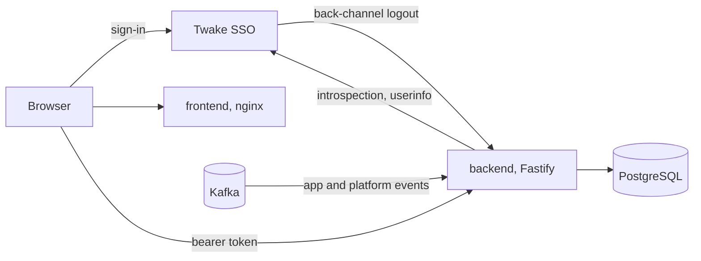

# Twake Space

A space groups what a team has in the Twake apps (chat, mail, drive, calendar, meet, kanban) and shows its activity in one place.



## Repository

- `apps/backend`: Node service. `src/infra` holds the Kafka, PostgreSQL and HTTP plumbing, `src/events` routes incoming Kafka events, and each feature lives in `src/modules/<name>` with its own schema and tests.
- `apps/frontend`: React single-page app, served by nginx in production. The code is split into `application`, `adapters`, `ui` and `app`, and ESLint checks which of them may import which.

## Run it locally

You need Node 24 (`nvm use`) and Docker.

```bash
npm ci
docker compose up -d
cp apps/backend/.env.example apps/backend/.env
```

Compose starts Kafka, creates its topics, and starts PostgreSQL. Then fill in `apps/backend/.env`:

- `LDAP_REST_SECRET`: the ldap-rest shared secret, 32 characters or more
- `OIDC_CLIENT_SECRET`: the secret of the `twakespace-backend` client on the SSO

The frontend reads its SSO settings from `apps/frontend/public/.env.js`, which is gitignored. Create it:

```js
var SSO_BASE_URL = 'https://sign-up.twake.app/'
var SSO_CLIENT_ID = 'twakespace'
var SSO_SCOPE = 'openid email profile'
var SSO_REDIRECT_URI = 'http://localhost:3000/auth/callback'
var SSO_POST_LOGOUT_REDIRECT = 'http://localhost:3000/'
```

Start both apps. The backend applies its migrations on startup.

```bash
npm run dev -w @twake-space/backend
npm run dev -w @twake-space/frontend
```

The frontend is on http://localhost:3000 and the backend on http://localhost:8080.

## Before you push

- `npm run check` runs lint, Prettier, typecheck, tests and build in every app, like the CI.
- After editing a `schema.ts`, run `npm run db:generate -w @twake-space/backend` and commit the migration it writes.

## Images and releases

Each app has its own Dockerfile and workflows (`.github/workflows/<app>-*.yml`):

- a pull request checks the app and builds its image
- a push to `main` publishes `ghcr.io/linagora/twake-space-<app>:latest`
- a tag `<app>-vX.Y.Z` that matches `apps/<app>/package.json` publishes `twake-space-<app>:X.Y.Z` and a GitHub release

`docker compose --profile app up --build` runs both images locally.

## Configuration

- The backend reads environment variables and checks them at startup (`apps/backend/src/config.ts`). `apps/backend/.env.example` lists them.
- The frontend image writes `/.env.js` and its Content-Security-Policy from the environment at startup (`SSO_*`, `POSTHOG_*`, `CSP_CONNECT_SRC`, `CSP_FRAME_SRC`, `CSP_FRAME_ANCESTORS`, `PERMISSIONS_POLICY`). It runs as a non-root user on a read-only root filesystem.
