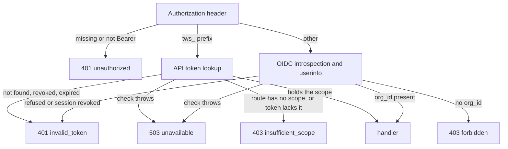

# HTTP API

Every route the backend serves. The space write routes of [#87](https://github.com/linagora/twake-space/pull/87) aren't merged yet, and have their own section at the end.

## Servers

The backend runs two HTTP servers.

- The API server listens on `HTTP_HOST:HTTP_PORT` (default `0.0.0.0:8080`) and serves every route below except `/metrics`.
- The metrics server listens on `HTTP_HOST:METRICS_PORT` (default `9464`) and serves `/metrics` plus its own `/health/live` and `/health/ready`.

Request logging skips every path under `/health/`.

## Authentication

Every route behind `authorize` reads `Authorization: Bearer <token>`. The token's prefix picks how it is checked.

- A token starting with `tws_` is an API token. Its SHA-256 hash is looked up among tokens that are not revoked and not expired, and its `lastUsedAt` is stamped. A token owned by a technical account also needs that account to still exist in ldap-rest (checked at most every 5 minutes per account).
- Any other token is an OIDC access token. The backend introspects it and fetches userinfo in parallel. It refuses a token that is inactive, expired, missing the configured audience, or whose userinfo lacks `sub`, `uuid`, `email` or `sid`. A valid identity is cached for 60 seconds (never past the token's expiry), and its session id is checked against revoked sessions on every request. A refused token is remembered for 60 seconds too (up to 10,000 of them per replica), so sending it again costs no provider call. A provider error is not a refusal and is never remembered.

This gives two kinds of caller.

- A session caller holds an OIDC access token. Its user id is the `uuid` claim and its organization is the `org_id` claim.
- A token caller holds an API token. An account token acts for one account (a person or a technical account). An organization token acts for no account and carries its own space role (`viewer`, `editor` or `admin`). Either one covers every space of the organization or a list of spaces.

API token scopes are `space:read`, `space:write`, `members:write`, `feed:read` and `tokens:write`.

`authorize(scope)` decides who gets in.

- A session caller gets in whatever the scope, as long as its identity has an `org_id`.
- A token caller gets in only when the route names a scope and the token holds it. A route registered with `authorize()` and no scope is for session callers only.



The refusals look like this.

- `401 {"error":"unauthorized"}` with `WWW-Authenticate: Bearer` when the header is missing or not a Bearer token.
- `401 {"error":"unauthorized"}` with `WWW-Authenticate: Bearer error="invalid_token"` when the token is refused.
- `403 {"error":"insufficient_scope"}` with `WWW-Authenticate: Bearer error="insufficient_scope", scope="<scope>"` for a token caller (the `scope` part is absent on a route with no scope).
- `403 {"error":"forbidden"}` for a session caller with no organization.
- `503 {"error":"unavailable"}` when the identity provider or the database fails during the check.

## Errors

- Error bodies are JSON with an `error` code, sometimes with a human `message`: `{"error":"invalid_request","message":"..."}`.
- `400 invalid_request` means the query or body failed its schema. The token routes and `PUT /notifications/settings` add a `message`.
- `404 not_found` covers both a resource that does not exist and one the caller cannot reach. A malformed id in the path also answers 404 on the read routes.
- Any other thrown error, including an ldap-rest failure on the directory routes, answers `500 {"error":"internal"}`. The error itself goes to the log only.
- The Matrix transaction route uses Matrix error bodies instead: `{"errcode":"M_FORBIDDEN","error":"..."}`. It checks the `hs_token` before reading the body.

## Spaces

### GET /spaces

- Caller: session, or token with `space:read`.
- Returns the spaces the caller reaches, sorted by name, with the role it acts with in each.
- A session caller or an account token reaches the spaces its account is a member of. An organization token reaches every space of the organization and acts with its own role. A token that covers a list of spaces reaches only those.

```json
{ "spaces": [{ "id": "<uuid>", "name": "Design", "role": "admin" }] }
```

### GET /spaces/:id

- Caller: session, or token with `space:read`.
- Path: `id` is a UUID.
- `404 {"error":"not_found"}` when `id` is not a UUID or the caller does not reach the space.
- `chat` and `mail` are the organization's chat and mail availability, false when the organization is unknown. `homeserverUrl` is the organization's Matrix homeserver, or null.
- `resources` lists every kind (`drive`, `mailbox`, `calendar`, `matrix_space`, `project`). A kind whose `id` is null is still being prepared by its app.

```json
{
  "id": "<uuid>",
  "name": "Design",
  "role": "editor",
  "chat": true,
  "mail": false,
  "homeserverUrl": "https://matrix.example.com",
  "members": [
    {
      "id": "<uuid>",
      "username": "jdoe",
      "email": "jdoe@example.com",
      "role": "admin"
    }
  ],
  "groups": [{ "id": "<uuid>", "name": "Sales", "role": "viewer" }],
  "resources": [
    { "kind": "drive", "id": "<resource id>" },
    { "kind": "project", "id": null }
  ]
}
```

## Organization directory

These routes list the people and groups of the caller's organization from ldap-rest, for a space admin to pick from. Pages hold 20 entries.

- Caller: session only.
- Query: `search` (optional, trimmed, at least 2 characters), `page` (integer from 1, default 1).
- `400 {"error":"invalid_request"}` when the query fails.

### GET /organization/members

Lists active members.

```json
{
  "members": [
    {
      "username": "jdoe",
      "email": "jdoe@example.com",
      "displayName": "Jane Doe"
    }
  ],
  "hasNextPage": false
}
```

### GET /organization/groups

A group's `name` is its display name, or its `cn` when it has none.

```json
{ "groups": [{ "id": "<id>", "name": "Sales" }], "hasNextPage": true }
```

## Notifications

All notification routes are for session callers only and act on the caller's own notifications.

### GET /notifications

- Query: `before` (optional UUID, the last notification of the previous page), `limit` (1 to 100, default 50).
- Newest first. `unread` counts every unread notification of the user, not only this page.
- `type` is one of `card_mention`, `message_mention`, `assignment`, `invitation`, `attended_event_change`, `space_change`.
- `activity` comes from the activity event behind the notification. `category` is one of `messages`, `files`, `activities`, `events`.
- `400 {"error":"invalid_request"}` when the query fails.

```json
{
  "notifications": [
    {
      "id": "<uuid>",
      "type": "assignment",
      "spaceId": "<uuid>",
      "createdAt": "2026-10-06T09:00:00.000Z",
      "activity": {
        "type": "...",
        "category": "activities",
        "actor": {},
        "content": {},
        "time": "..."
      },
      "read": false
    }
  ],
  "unread": 3
}
```

### POST /notifications/read

Marks every unread notification of the caller as read. Answers `204`.

### POST /notifications/:id/read

- Path: `id` is a UUID.
- Marks one notification as read and keeps its first read time. Answers `204`.
- `404 {"error":"not_found"}` when `id` is not a UUID or the notification is not the caller's.

### GET /notifications/settings

Returns whether each notification type is on. A type the user never chose is on, except `space_change`.

```json
{
  "settings": {
    "card_mention": true,
    "message_mention": true,
    "assignment": true,
    "invitation": true,
    "attended_event_change": true,
    "space_change": false
  }
}
```

### PUT /notifications/settings

- Body: an object of notification type to boolean. Only the types sent change.
- Answers `204`.
- `400 {"error":"invalid_request","message":"..."}` when the body fails.

## Live stream

### GET /stream

- Caller: session only.
- Answers `200` with `Content-Type: text/event-stream`, `Cache-Control: no-store` and `X-Accel-Buffering: no`.
- It opens with the comment `: open` and sends `: heartbeat` every 25 seconds.
- The stream ends when the access token expires, when the session is logged out through back-channel logout (on every replica), and when the server shuts down. A person keeps at most 10 open streams per replica: opening another ends their oldest.

The events carry no state; they tell the client what to reload.

- `notification` with data `{}`, sent to each user who just got a new notification.
- `spaces` with data `{"spaceId":"<uuid>"}`, sent when a space changes for the user. Who gets it depends on the change:
  - every member, when the space is renamed, its groups change (a linked group renamed included), or a resource is provisioned;
  - the added or updated members, when members are added or change role;
  - the removed members, when members are removed;
  - the former members, when the space is deleted.

```
event: spaces
data: {"spaceId":"<uuid>"}
```

## Organization tokens

All token routes use `authorize('tokens:write')`: a session caller, or a token caller holding `tokens:write`. The same five routes exist under three prefixes, one per owner.

- `/tokens` manages the caller's own account tokens. An organization token gets `403 {"error":"forbidden","message":"not an account token"}`.
- `/organization/tokens` manages organization tokens. The caller's account must be an `owner` or `admin` of the organization.
- `/organization/technical-accounts/:accountId/tokens` manages the tokens of one technical account. The caller must be an organization admin and `accountId` must be a technical account of the organization in ldap-rest.

An organization token itself manages no tokens on the two organization prefixes (`403 forbidden`, `"an organization token manages no tokens"`).

### POST {prefix}

Body:

- `name`: 1 to 100 characters, trimmed.
- `scopes`: at least one scope.
- `spaces`: `"all"` or a non-empty list of space UUIDs.
- `role`: `viewer`, `editor` or `admin`. Required on `/organization/tokens` and refused on the other prefixes.
- `expiresInDays`: 7, 30, 90 or 365. Or `expiresAt`: an ISO date time with offset, or null for a token that never expires. Not both. With neither, the token lasts 30 days.

Refusals:

- `400 invalid_request` when the body fails, the expiry is in the past, the organization's policy refuses the expiry, or a listed space is not one the owner reaches (a member space for an account, any organization space for the organization).
- `403 forbidden` with `"more rights than the token creating it"` when a token caller asks for a scope it lacks, a space it does not cover, or a later expiry than its own.

Answers `201`. The `token` value appears only in this response.

```json
{
  "id": "<uuid>",
  "name": "CI",
  "token": "tws_...",
  "scopes": ["space:read"],
  "spaces": "all",
  "role": null,
  "expiresAt": "2026-11-05T09:00:00.000Z"
}
```

### GET {prefix}

Lists active tokens, oldest first.

```json
{
  "tokens": [
    {
      "id": "<uuid>",
      "name": "CI",
      "scopes": ["space:read"],
      "role": null,
      "expiresAt": null,
      "lastUsedAt": null,
      "createdAt": "...",
      "spaces": ["<uuid>"]
    }
  ]
}
```

### PATCH {prefix}/:id

- Body: `{"name":"..."}` with the same rules as on creation.
- Answers `204`.
- `404 not_found` when the token is not an active token the caller manages. This includes a caller with no right on the prefix and an `id` that is not a UUID.

### DELETE {prefix}/:id

Revokes the token. Answers `204`, or `404 not_found` under the same conditions as PATCH.

### GET /organization/token-policy

- Caller: organization admin.
- Without a stored policy it returns the default below.

```json
{ "allowNoExpiry": false, "maxLifetimeDays": null }
```

### PUT /organization/token-policy

- Caller: organization admin.
- Body: `allowNoExpiry` (boolean) and `maxLifetimeDays` (integer from 1 to 3650, or null). Both are required.
- Answers `204`.

### GET /organization/token-audit

- Caller: organization admin.
- Returns the latest 500 audit entries of the organization's tokens, newest first. `action` is `created`, `revoked` or `renamed`. `actor` is a user id, `token:<id>` for a token caller, or the event routing key for automatic revocations.

```json
{
  "entries": [
    {
      "tokenId": "<uuid>",
      "tokenName": "CI",
      "action": "revoked",
      "actor": "...",
      "at": "...",
      "reason": "revoked by hand"
    }
  ]
}
```

## Auth

### POST /auth/backchannel-logout

- Caller: the OIDC provider. No bearer token.
- Body: `logout_token`, as `application/x-www-form-urlencoded` or JSON.
- The logout token must be a JWT signed by the issuer's keys, with the backend's audience, `iat`, `sid` and the back-channel logout event, and no `nonce`.
- Revokes the session for 24 hours, so its access tokens stop working and its open streams close.
- Answers `200` with an empty body and `Cache-Control: no-store`.
- `400 {"error":"invalid_request"}` when the body or the logout token fails.

## Matrix application service

### PUT /_matrix/app/v1/transactions/:txnId

- Caller: the Matrix homeserver, with its `hs_token` as a Bearer token or as the `access_token` query parameter.
- Body: `{"events":[...]}`, up to 8 MiB.
- Stores messages, edits, reactions and redactions from rooms linked to a space, and notifies mentioned members. A transaction id seen before is acknowledged without being stored again. Malformed events are skipped.
- Answers `200 {}`.
- `401 {"errcode":"M_UNAUTHORIZED","error":"missing hs_token"}`, `403 {"errcode":"M_FORBIDDEN","error":"unknown hs_token"}`, `400 {"errcode":"M_BAD_JSON","error":"invalid transaction"}`.

## Health and metrics

### GET /health/live

On the API server, answers `503 {"status":"unavailable"}` when the RabbitMQ connection is down, or when one message has been in its handler for over 5 minutes, and `200 {"status":"ok"}` otherwise. An idle consumer is alive. On the metrics server it always answers `200`.

### GET /health/ready

Answers `200 {"status":"ok"}` once the backend has started and the database answers, and `503 {"status":"unavailable"}` otherwise (including during shutdown). On the metrics server it always answers `200`.

### GET /metrics

Metrics server only. Prometheus text format, no authentication.

```
# HELP twake_space_cards_waiting Stored events not posted to Matrix yet.
# TYPE twake_space_cards_waiting gauge
twake_space_cards_waiting{organization="<org id>"} 0
# HELP twake_space_cards_failed Stored events the homeserver refused for good.
# TYPE twake_space_cards_failed gauge
twake_space_cards_failed{organization="<org id>"} 0
# HELP twake_space_events_total Messages handled, by outcome.
# TYPE twake_space_events_total counter
twake_space_events_total{outcome="processed"} 0
# HELP twake_space_parked_events Events waiting for a space or member.
# TYPE twake_space_parked_events gauge
twake_space_parked_events 0
```

- `twake_space_cards_waiting` and `twake_space_cards_failed`: every organization with chat available reports a value, 0 included. A failed card is not counted as waiting.
- `twake_space_events_total`: one series per outcome seen since the process started (`processed`, `duplicate`, `unrouted`, `malformed`, `rejected`, `parked`, `failed`), as listed in [events.md](events.md). Counts deliveries from RabbitMQ, so a message retried in the process counts once per attempt. Parked events retried are not counted.
- `twake_space_parked_events`: rows in `parked_events`, for every replica.

## Space writes

[#87](https://github.com/linagora/twake-space/pull/87) adds these routes. It waits on a release of ldap-rest-client. Each one writes to ldap-rest first, then copies the change into the backend's own tables. When that copy fails, the route still answers success, and the event ldap-rest sends for the write brings the change.

Shared rules:

- `POST`, `PATCH` and `DELETE /spaces/:id` need a session, or a token with `space:write`. The member and group routes need a session, or a token with `members:write`.
- Path ids are UUIDs. A malformed path or body answers `400 {"error":"invalid_request"}`, before any access check.
- On an existing space, the caller must reach it (`404 {"error":"not_found"}`) and act as its `admin` (`403 {"error":"not_space_admin"}`). An organization token acts with its own role.
- `role` is `viewer`, `editor` or `admin`. A space name is 1 to 255 characters, trimmed.
- A 4xx from ldap-rest other than 401 reaches the caller with the same status, as `{"error":"<ldap-rest code>"}`, or `{"error":"ldap_rest_refused"}` when ldap-rest gives no code. Examples in the code: last admin, unknown user, member with another role. Any other ldap-rest failure answers 500.

### POST /spaces

- Body: `{"name":"..."}`.
- The caller becomes the space's admin. It needs an account found in ldap-rest; otherwise, and for an organization token, it gets `403 {"error":"needs_an_account"}`.
- Answers `201`.

```json
{ "id": "<uuid>", "name": "Design", "role": "admin" }
```

### PATCH /spaces/:id

Body `{"name":"..."}`. Renames the space. Answers `204`.

### DELETE /spaces/:id

Deletes the space. Answers `204`.

### POST /spaces/:id/members

- Body: `usernames` (1 to 100 non-empty strings) and `role`.
- Answers `204`.

### PATCH /spaces/:id/members/:userId

- Body: `{"role":"..."}`.
- `404 not_found` when `userId` is not a member of the space.
- Answers `204`.

### DELETE /spaces/:id/members/:userId

Removes the member. `404 not_found` when `userId` is not a member. Answers `204`.

### POST /spaces/:id/groups

- Body: `groupIds` (1 to 100 UUIDs) and `role`.
- Answers `204`.

### PATCH /spaces/:id/groups/:groupId

Body `{"role":"..."}`. Answers `204`.

### DELETE /spaces/:id/groups/:groupId

Unlinks the group. Answers `204`.

## Open questions

- @rezk2ll Which `code` values does ldap-rest send on a refused space write? The PR passes them through as the `error` code, so clients will match on them and they should be listed here.
- @rezk2ll On `GET /notifications`, a `message_mention` has no activity event. Is `activity` then `null` or an object of nulls? The query left joins the activity event.
- @rezk2ll The read routes answer 404 on a malformed path id, the PR #87 write routes answer 400. Is that difference intended?
- @rezk2ll `GET /organization/groups` returns group `id`s from ldap-rest, and `POST /spaces/:id/groups` requires `groupIds` to be UUIDs. Are ldap-rest group ids always UUIDs?
- @rezk2ll On `/organization/tokens`, PATCH and DELETE answer 404 to a non admin while GET and POST answer 403. Is that intended?
- @rezk2ll An ldap-rest failure on the directory routes answers `500 internal`. Should it map to `503 unavailable` like the auth check?
