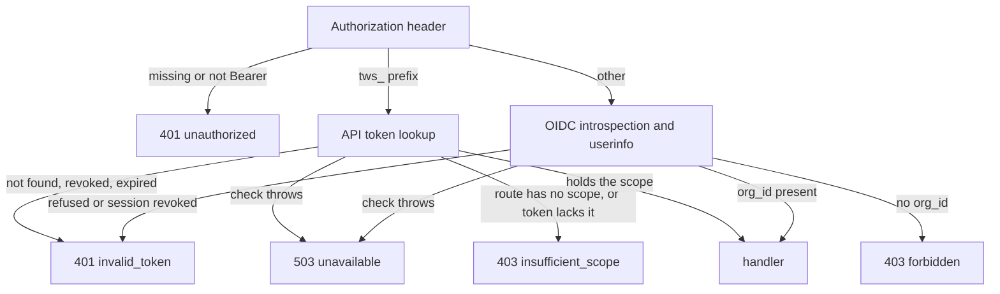

# HTTP API

Every route the backend serves. The routes that change a space through ldap-rest have their own section, [Space writes](#space-writes).

## Servers

The backend runs two HTTP servers.

- The API server listens on `HTTP_HOST:HTTP_PORT` (default `0.0.0.0:8080`) and serves every route below except `/metrics`.
- The metrics server listens on `HTTP_HOST:METRICS_PORT` (default `9464`) and serves `/metrics` plus its own `/health/live` and `/health/ready`.

Request logging skips every path under `/health/`.

## Authentication

Every route behind `authorize` reads `Authorization: Bearer <token>`. The token's prefix picks how it is checked.

- A token starting with `tws_` is an API token. Its SHA-256 hash is looked up among tokens that are not revoked and not expired, and its `lastUsedAt` is stamped (at most once a minute). An account token also needs its account to still be in the organization in ldap-rest, as a member or as a technical account (checked at most every 5 minutes per account and replica).
- Any other token is an OIDC access token. The backend introspects it and fetches userinfo in parallel. It refuses a token that is inactive, expired or without an expiry, missing the configured audience, whose userinfo lacks `sub`, `uuid`, `email` or `sid`, whose `uuid` is not a UUID or `email` not an address, or whose `sub` differs between introspection and userinfo. A valid identity is cached for 60 seconds (never past the token's expiry), and its session id is checked against revoked sessions on every request. A refused token is remembered for 60 seconds too (up to 10,000 of them per replica), so sending it again costs no provider call. A provider error is not a refusal and is never remembered.

This gives two kinds of caller.

- A session caller holds an OIDC access token. Its user id is the `uuid` claim and its organization is the `org_id` claim.
- A token caller holds an API token. An account token acts for one account (a person or a technical account). An organization token acts for no account and carries its own space role (`viewer`, `editor` or `admin`). Either one covers every space of the organization or a list of spaces.

API token scopes are `space:read`, `space:write`, `members:write`, `feed:read`, `tokens:write` and `notifications:write`. Only a technical account's token gets `notifications:write`.

`authorize(scope)` decides who gets in.

- A session caller gets in whatever the scope, as long as its identity has an `org_id`.
- A token caller gets in only when the route names a scope and the token holds it. A route registered with `authorize()` and no scope is for session callers only.



The refusals look like this.

- `401 {"error":"unauthorized"}` with `WWW-Authenticate: Bearer` when the header is missing or not a Bearer token.
- `401 {"error":"unauthorized"}` with `WWW-Authenticate: Bearer error="invalid_token"` when the token is refused.
- `403 {"error":"insufficient_scope"}` with `WWW-Authenticate: Bearer error="insufficient_scope", scope="<scope>"` for a token caller (the `scope` part is absent on a route with no scope).
- `403 {"error":"forbidden"}` for a session caller with no organization.
- `503 {"error":"unavailable"}` when the identity provider or the database fails during the check.

## Errors

- Error bodies are JSON with an `error` code, sometimes with a human `message`: `{"error":"invalid_request","message":"..."}`.
- `400 invalid_request` means the query or body failed its schema. The token routes, `PUT /notifications/settings` and `POST /notifications/suggestions` add a `message`, and so does every token route `403 forbidden`.
- `404 not_found` covers both a resource that does not exist and one the caller cannot reach. A malformed id in the path also answers 404 on the read routes.
- Errors Fastify raises itself keep Fastify's shape, `{"statusCode":400,"code":"...","error":"Bad Request","message":"..."}`: a body that is not valid JSON (400), an unsupported content type (415), a body over the limit (413, 1 MiB except on the banner route) and an unknown route (404).
- Any other thrown error, including an ldap-rest failure on the directory routes, answers `500 {"error":"internal"}`. The error itself goes to the log only.
- The Matrix transaction route uses Matrix error bodies instead: `{"errcode":"M_FORBIDDEN","error":"..."}`. It checks the `hs_token` before reading the body.

## Spaces

### GET /spaces

- Caller: session, or token with `space:read`.
- Returns the spaces the caller reaches, sorted by name, with the role it acts with in each, the avatar color picked at creation (null when none was), the description (empty when none was) and the people who are members of it, sorted by username.
- A member's `workplaceFqdn` is their Twake Workplace address from ldap-rest, where their avatar lives, or null when they have none or ldap-rest fails. It is cached for 10 minutes.
- A session caller or an account token reaches the spaces its account is a member of. An organization token reaches every space of the organization and acts with its own role. A token that covers a list of spaces reaches only those.
- `pinnedAt` is when the caller's account pinned the space and `openedAt` when it last opened it, both null when it did not. They are null for an organization token.
- `manages` tells whether the caller manages the space: it is its admin, an owner or admin of the organization, or the person who created it. An organization token manages the spaces it covers when its role is `admin`.
- Only active spaces are listed, and `GET /spaces/:id` answers 404 for the others. `?state=archived` or `?state=trashed` lists instead the archived spaces, or those in the Bin, that the caller manages, member or not. There, `role` is null when the caller's account is not a member (an organization token keeps its own role), `manages` is always true, and `pinnedAt` and `openedAt` are always null. Any other `state` answers `400 {"error":"invalid_request"}`.

```json
{
  "spaces": [
    {
      "id": "<uuid>",
      "name": "Design",
      "role": "admin",
      "color": "#46a2ff",
      "description": "Brand and product design",
      "pinnedAt": "2026-10-08T09:00:00.000Z",
      "openedAt": null,
      "manages": true,
      "members": [
        {
          "id": "<uuid>",
          "username": "jdoe",
          "displayName": "Jane Doe",
          "workplaceFqdn": "jdoe.twake.example.com"
        }
      ]
    }
  ]
}
```

### GET /spaces/apps

- Caller: session, or token with `space:read`.
- Returns the app tabs a new space can have: those whose app this deployment provides (`SPACE_APPS` in [Deploying](deploy.md#configuration)), less `chat` while the organization's chat is off, and `mail` while its mail is off. Every space has a feed, so `feed` is never listed.

```json
{ "apps": ["chat", "tasks", "mail"] }
```

### GET /spaces/:id

- Caller: session, or token with `space:read`.
- Path: `id` is a UUID.
- `404 {"error":"not_found"}` when `id` is not a UUID or the caller does not reach the space.
- `description` and `color` are what was picked at creation. `apps` is the tabs picked at creation or since, as stored: the client hides the tabs whose app this deployment or the organization does not provide. A space created outside twake-space has an empty description, no color and every tab.
- `chat` and `mail` are the organization's chat and mail availability, false when the organization is unknown. `homeserverUrl` is the organization's Matrix homeserver, or null.
- `createdAt` is when the backend learned of the space.
- `banner` is when the banner image last changed, or null without one. It changes with the image, so a client knows to read [the banner](#get-spacesidbanner) again.
- `pinnedAt`, `openedAt`, `manages` and each member's `displayName` and `workplaceFqdn` are as in `GET /spaces`.
- `resources` lists the kind (`drive`, `mailbox`, `calendar`, `matrix_space`, `project`) of each app this deployment provides, set by `SPACE_APPS` in [Deploying](deploy.md#configuration). A kind whose `id` is null is still being prepared by its app.

```json
{
  "id": "<uuid>",
  "name": "Design",
  "role": "editor",
  "createdAt": "2026-10-01T08:00:00.000Z",
  "color": "#46a2ff",
  "description": "Brand and product design",
  "apps": ["chat", "tasks", "drive"],
  "pinnedAt": null,
  "openedAt": "2026-10-08T09:00:00.000Z",
  "manages": false,
  "chat": true,
  "mail": false,
  "homeserverUrl": "https://matrix.example.com",
  "banner": "2026-10-08T09:30:00.000Z",
  "members": [
    {
      "id": "<uuid>",
      "username": "jdoe",
      "email": "jdoe@example.com",
      "displayName": "Jane Doe",
      "role": "admin",
      "workplaceFqdn": "jdoe.twake.example.com"
    }
  ],
  "groups": [{ "id": "<uuid>", "name": "Sales", "role": "viewer" }],
  "resources": [
    { "kind": "drive", "id": "<resource id>" },
    { "kind": "project", "id": null }
  ]
}
```

### GET /spaces/:id/banner

- Caller: session, or token with `space:read`.
- Answers the banner image as stored, with its `Content-Type`, `Cache-Control: private, no-cache` and `X-Content-Type-Options: nosniff`.
- `404 {"error":"not_found"}` when `id` is not a UUID, the caller does not reach the space, or the space has no banner.

### PUT /spaces/:id/pin, DELETE /spaces/:id/pin

- Caller: session.
- Pins the space for the caller, or unpins it. Answers `204`, or `404 {"error":"not_found"}` when the caller is not a member or the space is archived or in the Bin.

### PUT /spaces/:id/opened

- Caller: session.
- Sets the space's `openedAt` to now for the caller. The frontend sends it each time it shows a space. Answers like the pin.

## Organization directory

These routes list the people and groups of the caller's organization from ldap-rest, for a space admin to pick from. Pages hold 20 entries.

- Caller: session only.
- Query: `search` (optional, trimmed, at least 2 characters), `page` (integer from 1, default 1).
- `400 {"error":"invalid_request"}` when the query fails.

### GET /organization/members

Lists active members.

```json
{
  "members": [
    {
      "username": "jdoe",
      "email": "jdoe@example.com",
      "displayName": "Jane Doe"
    }
  ],
  "hasNextPage": false
}
```

### GET /organization/groups

A group's `name` is its display name, or its `cn` when it has none.

```json
{ "groups": [{ "id": "<id>", "name": "Sales" }], "hasNextPage": true }
```

## Settings

### GET /settings

- Caller: session only.
- Returns the caller's Twake Workplace settings, as the last `user.settings.updated` event for their email brought them ([Events](events.md#user-settings)). Each value is null when not set.
- `theme` is `light`, `dark` or `auto`. `avatar` is an `http` or `https` URL.

```json
{
  "language": "fr",
  "timezone": "Europe/Paris",
  "theme": "auto",
  "avatar": null,
  "displayName": "Jane Doe"
}
```

## Notifications

All notification routes are for session callers only and act on the caller's own notifications, except `POST /notifications/suggestions`, which takes an API token.

### GET /notifications

- Query: `before` (optional UUID, the last notification of the previous page), `limit` (1 to 100, default 50).
- Newest first. `unread` counts every unread notification of the user, not only this page.
- `type` is one of `card_mention`, `message_mention`, `assignment`, `invitation`, `attended_event_change`, `space_change`, `assistant_suggestion`.
- `payload` is `{}` except for an `assistant_suggestion`: `{ text, pendingCallId, matrixRoomId }`.
- `activity` comes from the activity event behind the notification. `category` is one of `messages`, `files`, `activities`, `events`.
- `400 {"error":"invalid_request"}` when the query fails.

```json
{
  "notifications": [
    {
      "id": "<uuid>",
      "type": "assignment",
      "spaceId": "<uuid>",
      "payload": {},
      "createdAt": "2026-10-06T09:00:00.000Z",
      "activity": {
        "type": "...",
        "category": "activities",
        "actor": {},
        "content": {},
        "time": "..."
      },
      "read": false
    }
  ],
  "unread": 3
}
```

### POST /notifications/read

Marks every unread notification of the caller as read. Answers `204`.

### POST /notifications/:id/read

- Path: `id` is a UUID.
- Marks one notification as read and keeps its first read time. Answers `204`.
- `404 {"error":"not_found"}` when `id` is not a UUID or the notification is not the caller's.

### GET /notifications/settings

Returns whether each notification type is on. A type the user never chose is on, except `space_change`.

```json
{
  "settings": {
    "card_mention": true,
    "message_mention": true,
    "assignment": true,
    "invitation": true,
    "attended_event_change": true,
    "space_change": false,
    "assistant_suggestion": true
  }
}
```

### PUT /notifications/settings

- Body: an object of notification type to boolean. Only the types sent change.
- Answers `204`.
- `400 {"error":"invalid_request","message":"..."}` when the body fails.

### POST /notifications/suggestions

For the user's assistant (Twake Harness), through an API token of a technical account with the `notifications:write` scope. A session, a person's token or an organization token gets `403 insufficient_scope`.

- Body: `matrixUserId` (`@localpart:server`), `externalId` (1 to 128 characters, one suggestion per user and `externalId`), `text` (1 to 500), `pendingCallId` (1 to 64), `matrixRoomId` (optional).
- The user is the space member of the token's organization whose username (or the part of their e-mail before `@`, per `MATRIX_LOCALPART`) is the localpart, case-insensitively, and the server name must be the organization's homeserver. `404 {"error":"unknown_user"}` when there is none, when two members share the localpart, or when the user is in another organization.
- Creates an `assistant_suggestion` notification and sends a `notification` live event. Answers `201 {"id":"<uuid>"}`.
- The same `externalId` again answers `200` with the existing `id`. When the user turned `assistant_suggestion` off, nothing is created and it answers `200 {"id":null}`.
- `400 {"error":"invalid_request","message":"..."}` when the body fails.

## Feed

A space's feed holds cards and posts. A card shows the activity on one object (a file, a calendar event, a task): the apps' later events about the object change the card instead of adding one. Members post and react.

`GET /spaces/:spaceId/feed` and `GET /spaces/:spaceId/feed/items/:itemId` also take an API token holding `feed:read`, on a space the token reaches. The other feed routes are for session callers only, and the caller must be a member of the space. Otherwise, when the space or item does not exist, or when an id in the path is not a UUID: `404 {"error":"not_found"}`. A failed query or body, or a malformed reaction key: `400 {"error":"invalid_request"}`.

A feed item:

- `id`, `kind` (`card` or `post`), `category` (`messages`, `files`, `activities` or `events`; a post is a message), `time`, `updatedAt`, and `reactions`, a list of `{key, userIds}` in the order they were first added.
- A card adds `type` (the activity event type), `actor` (`null` when the event names no one), `object` (`{type, id, title, container}`, where `container` is `{kind, id}` or `null`), `preview` (a string or `null`) and `state` (an object the app sends, such as a calendar event's time). `time` is the object's first event, so the card keeps its place; everything else comes from its latest event.
- A post adds `author`, `body` (plain text) and `editedAt` (`null` until edited).
- An actor or author is `{type: "user", id, name}`, `{type: "token", id, name}`, or `{type: "deleted_user"}`. For a user, `id` is `null` when the app named them by email only and no member has it, and `name` is the member's display name or username, or `null` when they are not a member of the space.

```json
{
  "id": "<uuid>",
  "kind": "card",
  "category": "files",
  "time": "2026-10-05T09:00:00.000Z",
  "updatedAt": "2026-10-05T10:00:00.000Z",
  "type": "com.twake.drive.file.updated.v1",
  "actor": { "type": "user", "id": "<uuid>", "name": "Alice Martin" },
  "object": {
    "type": "file",
    "id": "<id>",
    "title": "Roadmap.odt",
    "container": { "kind": "drive", "id": "<id>" }
  },
  "preview": "First draft",
  "state": {},
  "reactions": [{ "key": "👍", "userIds": ["<uuid>"] }]
}
```

### GET /spaces/:spaceId/feed

- Query: `category` (optional), `q` (optional, 1 to 200 characters once trimmed), `limit` (1 to 50, default 20), `before` (the `next` of the previous page).
- `q` keeps the posts whose body, and the cards whose title or preview, contain it, ignoring case.
- Answers `{"items": [...], "next": "<cursor>"}`, newest first by `time`. `next` is `null` on the last page. A `before` that is not a cursor answers 400.

### GET /spaces/:spaceId/feed/items/:itemId

Answers one item.

### GET /spaces/:spaceId/feed/read

Answers `{"readAt": "<time>"}`, the `time` of the newest item the caller has seen in the feed, or `null` before their first visit.

### PUT /spaces/:spaceId/feed/read

- Body: `{"readAt": "<time>"}`, an ISO 8601 time.
- Keeps the later of the stored time and this one, so a tab left on older items never moves it back. A time in the future counts as now. Answers `204`.

### POST /spaces/:spaceId/feed/posts

- Body: `{"body": "..."}`, 1 to 4000 characters once trimmed.
- Editors and admins only, otherwise `403 {"error":"cannot_post"}`.
- Answers `201` with the post.

### PATCH /spaces/:spaceId/feed/posts/:itemId

- Body: `{"body": "..."}`. Answers the post.
- Its author only, otherwise `403 {"error":"not_author"}`.

### DELETE /spaces/:spaceId/feed/posts/:itemId

Deletes the post and its reactions. Its author only, otherwise `403 {"error":"not_author"}`. Answers `204`.

### PUT /spaces/:spaceId/feed/items/:itemId/reactions/:key

- `key` is the reaction, URL-encoded, 1 to 16 characters, such as an emoji.
- Any member, viewers included. Adding the same reaction again changes nothing. Answers `204`.

### DELETE /spaces/:spaceId/feed/items/:itemId/reactions/:key

Takes the caller's reaction back. Answers `204`.

## Meetings

### POST /spaces/:spaceId/meetings

Asks the calendar to schedule a video meeting in the space's team calendar, as described in [Events](events.md#meeting-requests).

- Body: `title` (1 to 255 characters, trimmed), `start` and `end` (ISO 8601 with an offset, `end` after `start` and at most 24 hours later), `timezone` (IANA name), `description` (up to 4000 characters, optional) and `uid` (UUID, optional).
- A session only. Editors and admins, otherwise `403 {"error":"cannot_schedule"}`.
- `409 {"error":"no_calendar"}` when the calendar has not provisioned the space yet.
- `503 {"error":"unavailable"}` when RabbitMQ does not confirm the request, or no consumer is bound to it.
- Answers `202 {"uid":"<uuid>"}`. The meeting shows up as the feed card of the calendar event with that UID. A retry sends the same `uid`, so the calendar creates one meeting.

## Live stream

### GET /stream

- Caller: session only.
- Answers `200` with `Content-Type: text/event-stream`, `Cache-Control: no-store` and `X-Accel-Buffering: no`.
- It opens with the comment `: open` and sends `: heartbeat` every 25 seconds.
- The stream ends when the access token expires, when the session is logged out through back-channel logout (on every replica), and when the server shuts down. A person keeps at most 10 open streams per replica: opening another ends their oldest.

The events carry no state; they tell the client what to reload.

- `notification` with data `{}`, sent to each user who just got a new notification.
- `spaces` with data `{"spaceId":"<uuid>"}`, sent when a space changes for the user. Who gets it depends on the change:
  - every member, when the space is renamed, its apps or banner change, its groups change (a linked group renamed included), or a resource is provisioned;
  - the added or updated members, when members are added or change role;
  - the removed members, when members are removed;
  - every member and the organization's owners and admins, when the space is archived, moved to the Bin or restored;
  - the former members, when the space is deleted, and the organization's owners and admins too when it is deleted from the Bin.
- `feed` with data `{"spaceId":"<uuid>","itemId":"<uuid>","change":"added"}`, sent to every member when a feed item is `added`, `changed` (a later event, an edit, a reaction) or `removed`. The client reads an added or changed item with `GET /spaces/:spaceId/feed/items/:itemId`.

```
event: spaces
data: {"spaceId":"<uuid>"}
```

## Organization tokens

All token routes use `authorize('tokens:write')`: a session caller, or a token caller holding `tokens:write`. The same five routes exist under three prefixes, one per owner.

- `/tokens` manages the caller's own account tokens. An organization token gets `403 {"error":"forbidden","message":"not an account token"}`.
- `/organization/tokens` manages organization tokens. The caller's account must be an `owner` or `admin` of the organization, as ldap-rest answers on each call.
- `/organization/technical-accounts/:accountId/tokens` manages the tokens of one technical account. The caller must be an organization admin and `accountId` must be a technical account of the organization in ldap-rest.

No token manages tokens on the two organization prefixes, sets the policy, reads the audit log or lists the token spaces (`403 forbidden`, `"the organization tokens are managed from a signed-in session"`). Through the tokens it created, a token would reach spaces its own account is not in.

A token created by a token records it as its parent, and is revoked whenever its parent is, by hand or by an event.

### POST {prefix}

Body:

- `name`: 1 to 100 characters, trimmed.
- `scopes`: at least one scope.
- `spaces`: `"all"` or a non-empty list of space UUIDs.
- `role`: `viewer`, `editor` or `admin`. Required on `/organization/tokens` and refused on the other prefixes.
- `expiresInDays`: 7, 30, 90 or 365. Or `expiresAt`: an ISO date time with offset, or null for a token that never expires. Not both. With neither, the token lasts 30 days.

Refusals:

- `400 invalid_request` when the body fails, the expiry is in the past, the organization's policy refuses the expiry, or a listed space is not one the owner reaches (a member space for an account, any organization space for the organization).
- `403 forbidden` with `"more rights than the token creating it"` when a token caller asks for a scope it lacks, a space it does not cover, or a later expiry than its own.
- `403 forbidden` with `"notifications:write is for technical accounts"` when a person's token or an organization token asks for that scope.

Answers `201`. The `token` value appears only in this response.

```json
{
  "id": "<uuid>",
  "name": "CI",
  "token": "tws_...",
  "scopes": ["space:read"],
  "spaces": "all",
  "role": null,
  "expiresAt": "2026-11-05T09:00:00.000Z"
}
```

### GET {prefix}

Lists active tokens, oldest first.

```json
{
  "tokens": [
    {
      "id": "<uuid>",
      "name": "CI",
      "scopes": ["space:read"],
      "role": null,
      "expiresAt": null,
      "lastUsedAt": null,
      "createdAt": "...",
      "spaces": ["<uuid>"]
    }
  ]
}
```

### PATCH {prefix}/:id

- Body: `{"name":"..."}` with the same rules as on creation.
- Answers `204`.
- `404 not_found` when the token is not an active token the caller manages. This includes a caller with no right on the prefix and an `id` that is not a UUID.

### DELETE {prefix}/:id

Revokes the token and the tokens it created, down the line. Answers `204`, or `404 not_found` under the same conditions as PATCH.

### GET /organization/token-policy

- Caller: any session caller of the organization, or a token holding `tokens:write`, so a client offers only the lifetimes the policy allows.
- Without a stored policy it returns the default below.

```json
{ "allowNoExpiry": false, "maxLifetimeDays": null }
```

### GET /organization/token-spaces

- Caller: organization admin.
- Lists every space of the organization, by name: the spaces an organization token may cover, including those the admin is not in.

```json
{ "spaces": [{ "id": "<uuid>", "name": "Design" }] }
```

### PUT /organization/token-policy

- Caller: organization admin.
- Body: `allowNoExpiry` (boolean) and `maxLifetimeDays` (integer from 1 to 3650, or null). Both are required.
- Answers `204`.

### GET /organization/token-audit

- Caller: organization admin.
- Returns the latest 500 audit entries of the organization's tokens, newest first. `action` is `created`, `revoked` or `renamed`. `actor` is a user id, `token:<id>` for a token caller, or the event routing key for automatic revocations.

```json
{
  "entries": [
    {
      "tokenId": "<uuid>",
      "tokenName": "CI",
      "action": "revoked",
      "actor": "...",
      "at": "...",
      "reason": "revoked by hand"
    }
  ]
}
```

## Auth

### POST /auth/backchannel-logout

- Caller: the OIDC provider. No bearer token.
- Body: `logout_token`, as `application/x-www-form-urlencoded` or JSON.
- The logout token must be a JWT signed by the issuer's keys, with the backend's audience, `iat`, `sid` and the back-channel logout event, and no `nonce`.
- Revokes the session for 24 hours, so its access tokens stop working and its open streams close.
- Answers `200` with an empty body and `Cache-Control: no-store`.
- `400 {"error":"invalid_request"}` when the body or the logout token fails.

## Matrix application service

### PUT /_matrix/app/v1/transactions/:txnId

- Caller: the Matrix homeserver, with its `hs_token` as a Bearer token or as the `access_token` query parameter.
- Body: `{"events":[...]}`, up to 8 MiB.
- Stores messages, edits, reactions and redactions from rooms linked to a space, and notifies mentioned members. A transaction id seen before is acknowledged without being stored again. Malformed events are skipped.
- Answers `200 {}`.
- `401 {"errcode":"M_UNAUTHORIZED","error":"missing hs_token"}`, `403 {"errcode":"M_FORBIDDEN","error":"unknown hs_token"}`, `400 {"errcode":"M_BAD_JSON","error":"invalid transaction"}`.

## Health and metrics

### GET /health/live

On the API server, answers `503 {"status":"unavailable"}` when the RabbitMQ connection is down, or when one message has been in its handler for over 5 minutes, and `200 {"status":"ok"}` otherwise. An idle consumer is alive. On the metrics server it always answers `200`.

### GET /health/ready

Answers `200 {"status":"ok"}` once the backend has started and the database answers, and `503 {"status":"unavailable"}` otherwise (including during shutdown). On the metrics server it always answers `200`.

### GET /metrics

Metrics server only. Prometheus text format, no authentication.

```
# HELP twake_space_events_total Messages handled, by outcome.
# TYPE twake_space_events_total counter
twake_space_events_total{outcome="processed"} 0
# HELP twake_space_parked_events Events waiting for a space or member.
# TYPE twake_space_parked_events gauge
twake_space_parked_events 0
```

- `twake_space_events_total`: one series per outcome seen since the process started (`processed`, `duplicate`, `unrouted`, `malformed`, `rejected`, `parked`, `failed`), as listed in [events.md](events.md). Counts deliveries from RabbitMQ, so a message retried in the process counts once per attempt. Parked events retried are not counted.
- `twake_space_parked_events`: rows in `parked_events`, for every replica.

## Space writes

A route that changes what ldap-rest holds (the space, its name, members and groups) writes to ldap-rest first, then copies the change into the backend's own tables. When that copy fails, the route still answers success, and the event ldap-rest sends for the write brings the change. The apps, the banner and the state stay in twake-space and never reach ldap-rest.

Shared rules:

- `POST /spaces`, `PATCH /spaces/:id`, `PUT /spaces/:id/banner`, `PUT /spaces/:id/state` and the `DELETE` of a space or of the Bin need a session, or a token with `space:write`. The member and group routes need a session, or a token with `members:write`.
- Path ids are UUIDs. A malformed path or body answers `400 {"error":"invalid_request"}`, before any access check.
- On an existing space, the caller must reach it (`404 {"error":"not_found"}`) and act as its `admin` (`403 {"error":"not_space_admin"}`), except for its state and its deletion, which need a manager. An organization token acts with its own role.
- `role` is `viewer`, `editor` or `admin`. A space name is 1 to 255 characters, trimmed.
- A 4xx from ldap-rest other than 401 reaches the caller with the same status, as `{"error":"<ldap-rest code>"}`, or `{"error":"ldap_rest_refused"}` when ldap-rest gives no code. Examples in the code: last admin, unknown user, member with another role. Any other ldap-rest failure answers 500.

### POST /spaces

- Body: `{"name":"...","description":"...","color":"#46a2ff","apps":["chat","drive"]}`. Only `name` is required. `description` is up to 1000 characters, trimmed. `color` is a `#rrggbb` hex code, or null. `apps` lists the app tabs the space shows, among `chat`, `tasks`, `drive`, `mail` and `calendar`; every one when left out. A `feed` in `apps` is accepted and left out, since every space has a feed.
- The caller becomes the space's admin. It needs an account found in ldap-rest; otherwise, and for an organization token, it gets `403 {"error":"needs_an_account"}`.
- Answers `201`.

```json
{ "id": "<uuid>", "name": "Design", "role": "admin" }
```

### PATCH /spaces/:id

- Body: `{"name":"...","apps":["chat","drive"]}`, with at least one of the two.
- `name` renames the space.
- `apps` replaces the app tabs the space shows, among `chat`, `tasks`, `drive`, `mail` and `calendar` (`feed` answers 400 here). It sends `spaces` on the live stream to the members.
- Answers `204`.

### PUT /spaces/:id/banner

- Body: the image itself, `image/png`, `image/jpeg`, `image/webp` or `image/gif`, up to 5 MiB. The caller is checked before the body is read.
- `415 {"error":"not_an_image"}` for an empty body or another content type, and `413` (in Fastify's shape) over 5 MiB.
- Replaces the banner and sends `spaces` on the live stream to the members. Answers `204`.

### PUT /spaces/:id/state

- Body: `{"state":"archived"}`, or `trashed` to move it to the Bin, or `active` to restore it. The state stays in twake-space: ldap-rest and the other apps still hold the space.
- Needs a caller who manages the space (see `GET /spaces`), whatever its state. A member of an active space who does not manage it gets `403 {"error":"not_space_manager"}`, anyone else `404 {"error":"not_found"}`.
- Sends `spaces` on the live stream to the space's members and the organization's owners and admins. Answers `204`.

### DELETE /spaces/:id

- Deletes the space for good, from ldap-rest then from the copy. A space ldap-rest no longer knows is removed from the copy all the same. Needs a caller who manages it, as for its state, and a space in the Bin, or answers `409 {"error":"not_in_bin"}`.
- Answers `204`.

### DELETE /spaces/bin

- Deletes for good every space in the Bin the caller manages, one after the other. The first ldap-rest failure stops it and answers as above: the spaces left stay in the Bin, so sending it again finishes the job.
- Answers `204`.

### POST /spaces/:id/members

- Body: `usernames` (1 to 100 non-empty strings) and `role`.
- Answers `204`.

### PATCH /spaces/:id/members/:userId

- Body: `{"role":"..."}`.
- `404 not_found` when `userId` is not a member of the space.
- A person in the space only through a linked group is added as a direct member, and keeps the stronger of this role and their group's.
- Answers `204`.

### DELETE /spaces/:id/members/:userId

Removes the member. `404 not_found` when `userId` is not a member. A member ldap-rest no longer holds is removed from the copy all the same. Answers `204`.

### POST /spaces/:id/groups

- Body: `groupIds` (1 to 100 UUIDs) and `role`.
- Answers `204`.

### PATCH /spaces/:id/groups/:groupId

Body `{"role":"..."}`. Answers `204`.

### DELETE /spaces/:id/groups/:groupId

Unlinks the group. Answers `204`.

## Open questions

- @rezk2ll Which `code` values does ldap-rest send on a refused space write? The routes pass them through as the `error` code, so clients will match on them and they should be listed here.
- @rezk2ll On `GET /notifications`, a `message_mention` has no activity event. Is `activity` then `null` or an object of nulls? The query left joins the activity event.
- @rezk2ll The read routes answer 404 on a malformed path id, the space write routes answer 400. Is that difference intended?
- @rezk2ll `GET /organization/groups` returns group `id`s from ldap-rest, and `POST /spaces/:id/groups` requires `groupIds` to be UUIDs. Are ldap-rest group ids always UUIDs?
- @rezk2ll On `/organization/tokens`, PATCH and DELETE answer 404 to a non admin while GET and POST answer 403. Is that intended?
- @rezk2ll An ldap-rest failure on the directory routes answers `500 internal`. Should it map to `503 unavailable` like the auth check?
