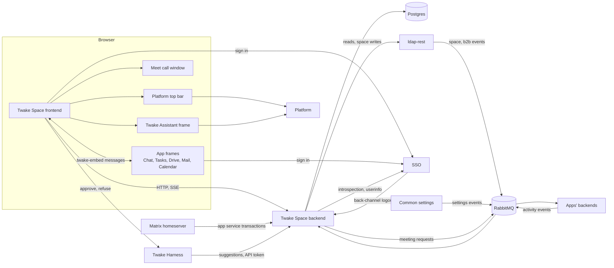
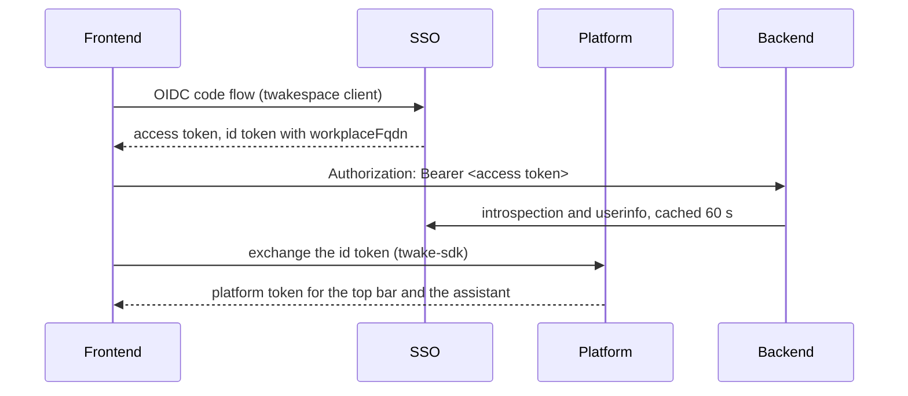
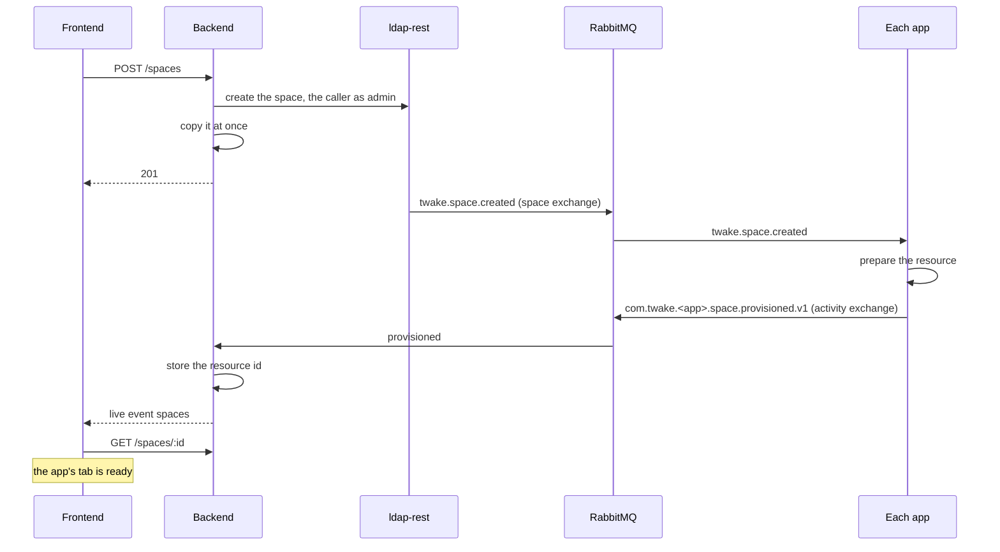
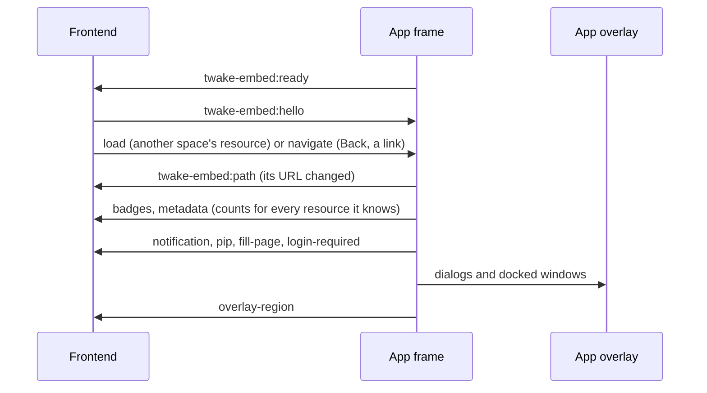

# Architecture

How Twake Space fits among the Twake apps: what each side owns, and how they talk.

## Terms

- Space: a team's workspace. ldap-rest holds it and its members.
- App: Twake Chat, Tasks, Drive, Mail or Calendar. Each one prepares a resource for every space.
- Resource: what an app prepared for a space, such as a Matrix space, a Tasks project or a team mailbox. The space's tab for that app shows it.
- Platform: each person's Twake Workplace instance, which serves the top bar, their Drive and their assistant.
- Copy: the backend's Postgres copy of spaces, members and resources, built from events.

## The pieces

- The frontend draws the shell, the home, the feed and the members, and frames each app in its tab. It never calls an app's backend.
- The backend serves the spaces, the feed, the notifications and the API tokens. It never calls an app either: apps reach it through RabbitMQ, and Matrix through the app service API.
- Other servers call the backend's HTTP API in three cases only: the SSO for back-channel logout, the homeserver for its transactions, and API token holders, Twake Harness among them.

## Who owns what

- ldap-rest owns the organizations, people, groups, technical accounts and spaces with their members and roles. A space write goes to ldap-rest first, and its event updates every app.
- Each app owns its resources and what is in them: messages, tasks, files, mail and events.
- Twake Space owns its copy, the feed (cards, posts, reactions), the notifications, each space's description, color, apps, banner and state (active, archived, in the Bin), and each person's pins and visits.
- The SSO owns the sessions. Common settings owns each person's language, theme, timezone, avatar and display name.

Archiving a space or moving it to the Bin stays in Twake Space: ldap-rest and the apps still hold it. Only a deletion from the Bin reaches ldap-rest, and the apps then hear `twake.space.deleted`.

## Signing in

- The frontend holds the tokens in the browser. The backend takes bearer tokens only, no cookies.
- The `workplaceFqdn` claim names the person's platform. Without it the app runs without the top bar, the assistant and Drive.
- Each app in a frame signs in on its own with the same SSO, silently. When it cannot, it posts `twake-embed:login-required` and the frontend signs in again.
- The SSO calls the backend's back-channel logout, which closes the session's live streams on every replica.

[HTTP API](api.md#authentication) has the details, and API tokens.

## Creating a space

- Members, groups and renames go the same way: ldap-rest first, then its event to the backend and every app.
- A tab shows as being prepared until its resource arrives, and as stalled after 2 minutes. Chat also needs the organization's homeserver.
- `SPACE_APPS` and the space's own `apps` decide which tabs exist. Chat and mail also depend on the organization: the chat control plane and `dns.validated` tell.

[Events](events.md) covers every event the backend handles.

## Apps in the tabs

Each app is framed once for the whole session, at its embed route for the space's resource, and kept while the person moves between spaces and tabs. The contract is [`@linagora/twake-embed`](https://github.com/linagora/twake-libs/tree/427b0508d87480dc10f972be9ef6bd7175ad853d/packages/twake-embed) ([ADR 010](https://github.com/linagora/twake-space-architecture/blob/bbcb1ffe03e5452c99325662f247dadba8fecb7c/ADR010.md), [metadata](https://github.com/linagora/twake-space-architecture/blob/f11d90c122393d20d236eca5017c25fcc338e5dd/ADR010.md)).

- Chat: `CHAT_URL/embed/rooms/<Matrix space id>`
- Tasks: `TASKS_URL/embed/projects/<project id>`
- Drive: `<person's Drive>/#/embed/sharings/<sharing id>`, on each person's own platform
- Mail: `MAIL_URL/embed/team-mailboxes/<mailbox id>`
- Calendar: `CALENDAR_URL/embed/calendars/<calendar id>`

- The frontend owns the browser history. A frame never adds an entry: it reports its path, and the frontend moves it with `load` and `navigate`.
- Hidden frames stay loaded and follow the space shown, so every app keeps reporting its counts. The tabs and the list of spaces show them.
- An app draws its dialogs on its overlay, `<app>/embed/overlay.html`, an empty page of its own origin over the whole page.
- The browser shows the system notifications an app asks for, since a frame cannot. A click opens the app at the resource.
- Chat may take the whole page during a call (`fill-page`). Any app may ask to open a Meet room in the call window (`pip`): only rooms of `MEET_URL` open.
- Mail still talks through cozy-external-bridge, and Tasks may send its older `twake-tasks:path`. The frontend accepts both.
- Each app lists the origin of Twake Space in its `frame-ancestors`, and Twake Space lists the apps in its `frame-src`. [Deploying](deploy.md#runtime-configuration) lists the settings on both sides.

## The feed

The feed is Twake Space's own: it reads no app and no homeserver from the browser.

- Apps publish activity events (CloudEvents) on the `activity` exchange. Each one updates the card of its object, in the space whose resource holds it.
- The homeserver pushes Chat's messages, reactions and mentions as app service transactions.
- Members post and react through the backend.
- A card's title opens the object in its app's tab. An event card opens Calendar's preview of it.

[Events](events.md#activity-events) has the CloudEvent fields and the card rules.

## Meetings

- Scheduling: the frontend calls `POST /spaces/:spaceId/meetings`, and the backend publishes a meeting request on the `twake-space` exchange. The calendar side service creates the Meet room and the event in the space's team calendar, and the event's activity event brings its card. [Events](events.md#meeting-requests) has the message.
- Joining: the space header and the apps open a room of `MEET_URL` in a floating call window that stays while the person moves around.

## The assistant

Two separate pieces:

- Twake Assistant: the panel of a space frames the assistant that the person's platform serves, through a platform intent (`io.cozy.ai.chat.conversations`). Its answer can be posted to the space's feed.
- Twake Harness: the person's agent pushes suggestions to `POST /notifications/suggestions` with a technical account's API token. The frontend shows them top right, and its buttons call Harness at `HARNESS_URL` with the person's access token.

## Settings

Common settings publishes `user.settings.updated` on the `settings` exchange with each change. The backend keeps the latest per email and serves it at `GET /settings`, and the frontend applies the language, theme, timezone, name and avatar. Twake Space never calls common settings. [Events](events.md#user-settings) has the rules.

## Twake Workplace home and bar

Twake Space is listed in the registry as a standalone app with no code: the home and the bar open the URL of the `space.embedded-app-url` flag. [README](../README.md#publish-it-on-the-registry) covers the release.

## Open questions

- @rezk2ll [ADR 010](https://github.com/linagora/twake-space-architecture/pull/10) and its [metadata change](https://github.com/linagora/twake-space-architecture/pull/13) are still open pull requests, like every ADR this doc links. Should the links move to `main` once they merge?
- @rezk2ll Which metadata names (`tasks.done`, `tasks.total` and so on) has each app agreed to send? The contract leaves them to each app and Twake Space.
