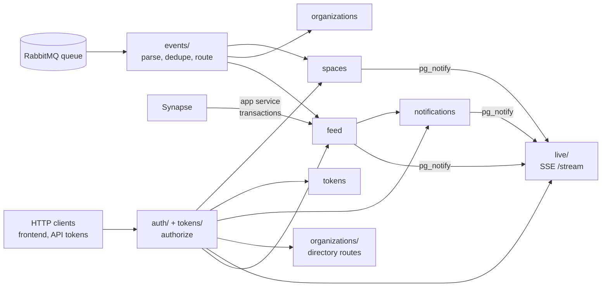
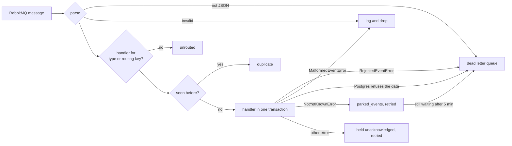

# Backend development

How to run the Twake Space backend, how it is laid out, and where new code goes.

The backend is a Fastify server on Node 24 that keeps a copy of spaces, members and app activity in Postgres. It fills that copy from RabbitMQ events and from Matrix app service transactions, and serves it over HTTP to the frontend and to API token holders.

## Run it

You need Node 24 and Docker.

```bash
npm ci
docker compose up -d
cp apps/backend/.env.example apps/backend/.env
npm run dev -w @twake-space/backend
```

- `docker compose up -d` starts RabbitMQ, declares the `space`, `b2b` and `admin-panel` exchanges the backend expects, and starts Postgres. The `backend` and `frontend` services sit behind the `app` profile and do not start by default.
- Fill in `LDAP_REST_SECRET` and `OIDC_CLIENT_SECRET` in `.env`. The other values in `.env.example` match the compose services.
- `npm run dev` runs `src/main.ts` with `node --watch`, loads `.env` if it exists, and preloads `src/instrument.ts` for Sentry. Node runs the TypeScript directly, there is no build step in dev.
- The API listens on port 8080. `/health/live` and `/health/ready` answer there, and `/metrics` answers on port 9464.

At startup the backend runs OIDC discovery against `OIDC_ISSUER`, so the issuer must be reachable or it stops. Signing in for real also needs an ldap-rest with spaces, which isn't released yet, so the full local stack can't be set up from this repo: ask Khaled Ferjani.

`src/config.ts` validates the environment at startup and stops with a list of every invalid key. [Deploying](deploy.md#configuration) lists every variable.

## How the code is laid out



- `src/main.ts` is the only place that wires things. It loads the config, runs the migrations, builds the event routes, registers every module's routes on one Fastify server, starts the metrics server, then the RabbitMQ consumer and the background jobs. It also handles SIGTERM and SIGINT.
- `src/infra/` holds the adapters to the outside: `db.ts` (drizzle client, migrations), `http.ts` (Fastify server with health routes), `amqp.ts` (consumer, dead letter queue), `ldap-rest.ts` (the `Directory` interface), `matrix.ts` (Matrix client), `secrets.ts` (AES-256-GCM and hashing), `testing.ts` (test database).
- `src/events/` turns RabbitMQ messages into handler calls. More below.
- `src/modules/` holds one folder per feature. A module owns its `schema.ts` (its tables), its routes, and its event handlers.

What each module owns:

- `auth`: bearer authentication for sessions, the `authorize` pre-handler, back-channel logout and revoked sessions.
- `tokens`: API tokens (account, organization and technical account tokens), the organization's token policy, the token audit log, and revoking tokens when accounts, spaces or organizations go away.
- `spaces`: spaces, their members, linked groups, organization roles and app resources, all kept up to date from platform events. Serves `GET /spaces` and `GET /spaces/:id`.
- `organizations`: organizations (domain, chat and mail availability), homeservers, the chat control plane client, and the directory search routes `GET /organization/members` and `GET /organization/groups`.
- `feed`: activity cards from app events, members' posts and reactions under `/spaces/:spaceId/feed`, chat messages and reactions from Matrix transactions, the retention purge, and `/metrics`.
- `notifications`: per user notifications and settings, under `/notifications`.
- `live`: the Server-Sent Events stream at `GET /stream`, fed by Postgres `NOTIFY` so every replica hears committed changes.

Modules import each other's schemas and helpers directly. There is no module registry.

## Events from RabbitMQ

The consumer reads one queue, `twake-space`, bound to the `activity` exchange and to the platform exchanges (`space`, `b2b`, `admin-panel`). [Events](events.md#consuming-rabbitmq) lists the bindings.



- The `activity` exchange carries CloudEvents. They route by `type` (for example `com.twake.drive.file.created.v1`) and dedupe on `source` and `id`.
- The platform exchanges carry plain JSON. Those messages route by their routing key (for example `twake.space.created`) and dedupe on their message id.
- A handler gets the event, a transaction and a logger. The dedupe row and the handler's writes commit together.
- Throw `MalformedEventError` (or use `parseOrDrop`) for an event that can never be processed. Throw `RejectedEventError` for a well-formed event that contradicts the copy, so someone can look at it in the dead letter queue. Throw `NotYetKnownError` when the event needs a space or member that a late platform event may still bring. Any other error leaves the message unacknowledged, and it is retried after a growing delay.
- A new platform routing key needs a binding in `infra/amqp.ts` too, or the queue never receives it.
- Events can arrive out of order. `events/freshness.ts` (`fresh`) tells which objects an event may still change, using the `last_changes` table.

## Database and migrations

- Drizzle ORM on the `postgres` driver. Tables live in each module's `schema.ts`, and `drizzle.config.ts` collects every `src/**/schema.ts`.
- Migrations live in `apps/backend/drizzle/`, one folder per migration with its SQL and a snapshot.
- After changing a `schema.ts`, generate the migration and commit it with the change:

  ```bash
  npm run db:generate -w @twake-space/backend -- --name <what_changed>
  ```

- Generation reads the schema files and the snapshots. It does not connect to a database.
- The backend applies pending migrations itself at startup (`migrateDb` in `main.ts`), before it registers routes. There is no separate migrate command. The Docker image ships the `drizzle/` folder for this.
- Use the `timestamptz` helper from `infra/db.ts` for timestamp columns.

## Authentication

Every API route takes `Authorization: Bearer <token>`. There are no cookies. The token is one of two kinds:

- An OIDC access token from the SSO (a session). The backend introspects it, fetches userinfo, checks the audience, and caches the result for up to 60 seconds. Userinfo must carry `uuid`, `email` and `sid`. A session without an `org_id` claim gets 403.
- An API token, recognised by its `tws_` prefix. The backend looks up its hash in `api_tokens` and refuses it when revoked or expired.

`authorize(scope?)` returns the Fastify pre-handler that checks this and sets `request.caller`:

- `authorize()` lets sessions in only. API tokens get 403 `insufficient_scope`.
- `authorize('space:read')` lets sessions in, and API tokens holding that scope.
- `request.caller` is a `SessionCaller` (`kind: 'session'`) or a `TokenCaller` (`kind: 'token'`). Both carry `organizationId` and `userId`, and `userId` is null for an organization token.

API tokens:

- Scopes: `space:read`, `space:write`, `members:write`, `feed:read`, `tokens:write`.
- A token covers every space or a list of spaces (`spaceIds`).
- An account token acts for one account. An organization token acts for the organization and carries a space role (`viewer`, `editor` or `admin`) on every space it covers. A technical account token acts for an LDAP technical account, and the backend checks that account still exists (cached for 5 minutes).
- Tokens are managed under `/tokens` (own account), `/organization/tokens` and `/organization/technical-accounts/:accountId/tokens` (organization owners and admins), all behind `tokens:write`. A token cannot create a token with more scopes, spaces or lifetime than itself.
- The default lifetime is 30 days. The organization's policy (`/organization/token-policy`) can allow tokens without expiry and cap the lifetime.

Session revocation:

- The SSO calls `POST /auth/backchannel-logout`. The backend stores the session id as revoked for 24 hours and refuses its access tokens.
- Revocation is also sent with `pg_notify`, so every replica closes that session's live streams.

Some routes do not use `authorize`:

- `PUT /_matrix/app/v1/transactions/:txnId` takes the homeserver's hs_token, as a bearer token or the `access_token` query parameter.
- `/metrics` and the health routes take no token.

## Add a route

1. Write a `registerXRoutes(app, deps)` function in the module's `routes.ts`. Take what it needs (`db`, `authorize`, a `Directory`) as `deps`.
2. Pass `authorize()` or `authorize('<scope>')` as the route's `preHandler`. Read the caller from `request.caller`, and scope every query to `caller.organizationId` (and `caller.spaceIds` for a token).
3. Validate params, query and body with zod `safeParse`, and answer 400 `invalid_request` or 404 `not_found` on failure.
4. Call the register function from `main.ts`.
5. Write `routes.test.ts` next to it (see Tests).

A new scope is a new value in the `token_scope` enum in `modules/tokens/schema.ts`, so it needs a migration.

## Add an event handler

1. Write a `Handler<CloudEvent>` or `Handler<PlatformEvent>` in the module. Parse the payload with `parseOrDrop`, and write through the `tx` it receives.
2. Export it in a map from event type or routing key to handler, like `spacePlatformRoutes` or `resourceActivityRoutes`.
3. Add the map to the `routes` lookup in `main.ts`.
4. To push a change to open streams, call `tell` or `tellSpaceMembers` from `modules/live/notify.ts` inside the same transaction.

## Add a module

1. Create `src/modules/<name>/` with `schema.ts` for its tables, then routes and handlers as above.
2. Run `db:generate` if it adds tables.
3. Wire it in `main.ts`.

## Tests

- Vitest, with tests next to the code as `*.test.ts`. There is no vitest config file in the backend.
- Tests need the compose Postgres. `createTestDb()` from `infra/testing.ts` creates a fresh migrated database per test file and drops it after, so files run in parallel. Set `TEST_DATABASE_URL` to use another server.
- Tests do not need RabbitMQ, ldap-rest, the SSO or Matrix. Handlers are called directly, and the directory and Matrix are passed in as fakes.
- Route tests build a server with `createServer` from `infra/http.ts` and use `fakeAuth`, `anIdentity` and `aTokenCaller` from `modules/auth/testing.ts`, then call `app.inject`.

## Check before you push

```bash
npm run check -w @twake-space/backend
```

It runs ESLint, Prettier, the type check, the tests and the build. CI runs the same command with a Postgres 18 container, so start `docker compose up -d` first.

## Open questions

- @rezk2ll The `feed:read` scope exists, but no route checks it yet. Which route is it for?
