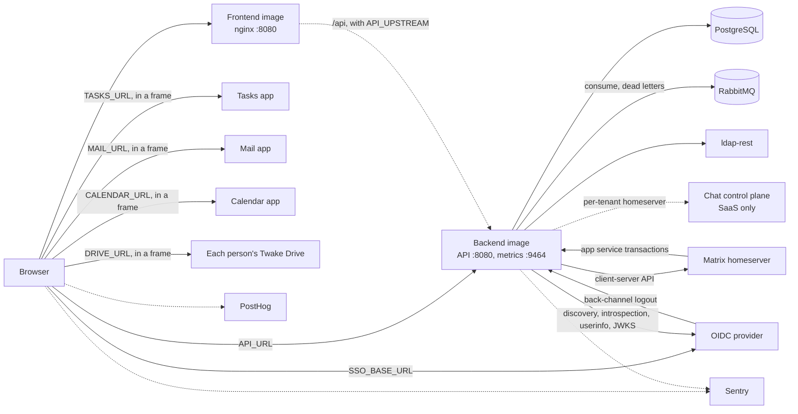

# Deploying and operating Twake Space

Twake Space ships as two container images:

- The frontend image serves the single page app with nginx.
- The backend image runs the Node.js API, the RabbitMQ consumer and the background jobs.

## Runtime dependencies



## Images and CI

Both images go to `ghcr.io/<repository owner>/twake-space-frontend` and `ghcr.io/<repository owner>/twake-space-backend`. The workflows run per app, triggered by changes under `apps/<app>/`, the root `package.json`, lock file, `tsconfig.base.json` and `.dockerignore`, and the workflows themselves. Pull requests also watch `eslint.config.js`, `.prettierrc` and `.nvmrc`.

- Pull request (and the merge queue): runs the app's check (`npm audit`, then `npm run check`, which lints, checks formatting, typechecks, tests and builds) and builds the image without pushing. The backend tests run against a `postgres:18` container.
- Push to `main`: runs the check, then builds and pushes the image tagged `latest`.
- Tag `frontend-vX.Y.Z` or `backend-vX.Y.Z` (a suffix such as `-rc.1` is accepted): verifies the tag (the commit is on `main`, the version is greater than the previous release, and it matches the app's `package.json`), runs the check, pushes the image tagged with the version and `latest`, then creates a GitHub release with generated notes.
- A frontend tag also publishes the app's manifest on the registry's dev channel, next to the image push. See [Publish it on the registry](../README.md#publish-it-on-the-registry).

The image build in CI runs `apps/<app>/docker/smoke-test.sh`. Both apps start their image as in production (read-only root filesystem, all capabilities dropped):

- Frontend (uid 101, `/tmp` as tmpfs): checks the served files, cache headers, CSP and logs.
- Backend (uid 1000), next to Postgres, RabbitMQ and a stub OIDC issuer: checks readiness, liveness, the queue's arguments, migrations, an unauthenticated API call, metrics, and a clean stop on `SIGTERM`.

## Frontend

The frontend image builds the app with Node 24 and serves it from `nginxinc/nginx-unprivileged:1.31-alpine`.

- Runs as uid 101 and listens on port 8080.
- Supports a read-only root filesystem. It needs a writable `/tmp`, where the entrypoint script writes `/tmp/nginx` and nginx keeps its temporary files and pid.
- Docker `HEALTHCHECK` fetches `http://127.0.0.1:8080/healthz` every 30 seconds.

### Served paths

- `/healthz` answers `200 ok`, not logged.
- `/.env.js` is the runtime configuration, sent with `Cache-Control: no-store`. `index.html` loads it before the app.
- `/static/` holds the hashed assets, sent with `Cache-Control: public, max-age=31536000, immutable`.
- Any other path falls back to `index.html`, sent with `Cache-Control: no-cache`.

### Runtime configuration

The entrypoint script `40-twake-space-runtime.sh` reads the environment at container start. Each variable below that is set and non-empty becomes a `var NAME = "value"` line in `/.env.js`. A value must fit on one line, or the container refuses to start.

- `API_URL`: the backend base URL, absolute or relative to the page origin. Required: the app throws at startup without it. With `API_UPSTREAM`, set it to `/api`.
- `SSO_BASE_URL`, `SSO_CLIENT_ID`, `SSO_SCOPE`, `SSO_REDIRECT_URI`, `SSO_POST_LOGOUT_REDIRECT`: the OIDC login settings. All five are required: the app throws without any of them. `SSO_SCOPE` must include `workplaceFqdn` for the platform top bar: it names the user's platform, which must accept the app's SSO client for token exchange.
- `TASKS_URL`: the Tasks app, embedded in a frame. Optional.
- `MAIL_URL`: the Mail app, whose team mailbox embed fills the Mail tab. Optional. Mail, like Tasks, also serves `/embed/overlay.html`, the overlay its composer and dialogs show on, over the whole page: it is on the origin of `MAIL_URL`, which `frame-src` already allows.
- `DRIVE_URL`: a template for each person's Twake Drive, whose shared drive embed fills the Drive tab, such as `https://{slug}-drive.{domain}/`. Optional. The app fills `{slug}` and `{domain}` from the person's Twake Workplace address (the `workplaceFqdn` claim, such as `alice.twake.example.com`). Every person has their own Drive origin, so `CSP_FRAME_SRC` must allow them all, such as `https://*.twake.example.com`.
- `CHAT_URL`: Twake Chat, whose `/embed/rooms/<Matrix space id>` fills the Chat tab of a space with the conversation of its Matrix space (ADR 010). Optional. Chat signs in inside its own frame and lists the origin of TwakeSpace in its own `frame-ancestors` (its `TWAKE_SPACE_URL`). Of the space tabs, its frame alone gets the camera, the microphone and the screen for its calls, and covers the whole page while Chat asks for it (`twake-embed:fill-page`, during a call): `PERMISSIONS_POLICY` must not turn off `camera`, `microphone` or `display-capture`, nor `fullscreen`, which every embedded frame and its overlay get for the browser's full screen of a video or a document.
- `CALENDAR_URL`: Twake Calendar, whose `/embed/calendars/<team calendar id>` fills the Calendar tab of a space with its team calendar (ADR 010). Optional. Calendar signs in silently by moving its frame to the SSO and back, and lists the origin of TwakeSpace in its own `frame-ancestors` (its `FRAME_ANCESTORS`) and `.env.js` (its `TWAKE_SPACE_ORIGIN`).
- `MEET_URL`: Twake Meet, such as `https://meet.example.com`. Optional. A room is `<MEET_URL>/<slug>`, and the space header's video menu opens rooms in TwakeSpace's call window. Meet signs in silently by moving its frame to the SSO and back, and lists the origin of TwakeSpace in its own `frame-ancestors` and in its bridge allowlist (`VITE_BRIDGE_TARGET_ORIGIN_ALLOWLIST`). Its frame gets the camera, the microphone, the screen, autoplay and full screen, so `PERMISSIONS_POLICY` must not turn those off.
- `HARNESS_URL`: Twake Harness, the user's assistant, whose `/v1/pending-calls/<id>/approve` and `/refuse` answer the buttons of an assistant suggestion (top right of every screen). Optional: without it a suggestion shows its text and a close button only. The browser calls it with the user's OIDC access token as a bearer, so the harness must accept Space's tokens (its `AUTH_AUDIENCE` must match Space's `OIDC_AUDIENCE`, `twakespace`), and the browser reaches it through APISIX, so the origin of `HARNESS_URL` must be one the gateway exposes and lets this origin call. Its origin is added to `connect-src`.
- `SENTRY_DSN`, `SENTRY_ENVIRONMENT`: browser error reporting. Optional. Events carry the tag `app` (`twake-space`), the release (the frontend version) and, in a space, the tag `space_tab` (the open tab).
- `SENTRY_FEEDBACK_ENABLED`: `true` shows the shared feedback button of `@linagora/twake-feedback`, which opens Sentry's form, with an optional email and a screenshot of the tab. The button is draggable and snaps to the left or right edge; its position is remembered per browser, and `Shift+F10` on it opens a menu to move it without dragging. Anything else, or no `SENTRY_DSN`, keeps it off. It needs a Sentry of 24.4.2 or later. The screenshot uses the browser's tab sharing prompt: it is not offered on mobile.
- `POSTHOG_KEY`, `POSTHOG_HOST`: written to `/.env.js`. See the open questions.

`API_UPSTREAM` is optional and not written to `/.env.js`. It is the backend's bare origin, for example `http://twake-space-backend.ns.svc.cluster.local`. nginx then forwards `/api/<path>` to `<API_UPSTREAM>/<path>`, so the browser reaches the API on the page's own origin. Without it, `/api/` answers 404.

- Use the full service name: nginx does not apply the search domains. It resolves the name with the first `nameserver` of `/etc/resolv.conf` and keeps the answer 30 seconds.
- A value that is not `http://` or `https://` plus a bare origin stops the container at start.
- The proxy takes request bodies up to 6 MB, above the backend's 5 MiB banner limit, and sends `X-Forwarded-For` and `X-Forwarded-Proto`.

### Security headers

The script also writes the security headers, sent on every path except `/healthz` and `/api/`.

- `Content-Security-Policy` has a fixed part: `default-src 'self'; script-src 'self'; style-src 'self' 'unsafe-inline'; font-src 'self' data:; object-src 'none'; base-uri 'self'; form-action 'self'`. `style-src` allows inline styles because MUI injects its styles at runtime.
- `connect-src` is `'self'` plus the origin of each of `API_URL`, `SSO_BASE_URL`, `HARNESS_URL`, `POSTHOG_HOST` and `SENTRY_DSN` that is an absolute `http` or `https` URL. The origin drops the user info, so the Sentry public key stays out of the header. `CSP_CONNECT_SRC` appends more sources. The platform top bar exchanges the SSO token on each person's own Twake Workplace (`https://<workplaceFqdn>/auth/token_exchange`), so `CSP_CONNECT_SRC` must allow them all, such as `https://*.twake.example.com`.
- `frame-src` is `CSP_FRAME_SRC` (default `'self'`) plus the origins of `TASKS_URL` and `CHAT_URL` when set. With `MAIL_URL`, `CALENDAR_URL` or `MEET_URL`, it also gets their origins and the origin of `SSO_BASE_URL`, because the Mail embed signs in through a frame on the SSO, and the Calendar embed and Meet move their frame to the SSO.
- `frame-ancestors` is `CSP_FRAME_ANCESTORS` (default `'self'`). Set it when another app embeds Twake Space.
- `img-src` is `'self' data: blob:` plus `CSP_IMG_SRC`. Set it to the origins of the avatars in Twake Workplace common settings, which each person's Cozy instance serves, such as `https://*.twake.example.com`.
- `Permissions-Policy` is `PERMISSIONS_POLICY`, by default `accelerometer=(), geolocation=(), gyroscope=(), magnetometer=(), payment=(), usb=()`.
- `X-Content-Type-Options: nosniff` and `Referrer-Policy: same-origin` are fixed.

The CSP variables must not contain double quotes, backslashes, dollar signs, semicolons or commas, so they cannot add directives. The check runs on each whole directive, so an app URL above with such a character stops the container too. `PERMISSIONS_POLICY` follows the same rule, commas allowed.

### Logs

nginx writes access logs to stdout and errors to stderr. The access log leaves out the query string, because the OIDC callback carries the code and state in it. `/healthz` and `/static/` are not logged.

## Backend

The backend image runs `node --import ./dist/instrument.js dist/main.js` on Node 24, as uid and gid 1000, with `NODE_ENV=production`. It exposes port 8080 (API) and 9464 (metrics). It has no Docker `HEALTHCHECK`; use the health endpoints below.

### Configuration

The backend reads its configuration from environment variables only, and refuses to start when one is invalid, listing every problem. There is no support for reading secrets from files: inject them as environment variables.

Required:

- `DATABASE_URL`: a `postgres://` or `postgresql://` URL.
- `AMQP_URL`: an `amqp://` or `amqps://` URL to RabbitMQ, with the user and password. Use `amqps://` for TLS; `NODE_EXTRA_CA_CERTS` adds a private CA.
- `LDAP_REST_URL`: an `http` or `https` URL.
- `LDAP_REST_SERVICE_ID`: the service id for HMAC authentication to ldap-rest.
- `LDAP_REST_SECRET`: the HMAC secret, at least 32 characters.
- `OIDC_ISSUER`: an `https` issuer URL.
- `OIDC_CLIENT_SECRET`: the backend's client secret at the OIDC provider.

Optional, with defaults:

- `OIDC_CLIENT_ID`: default `twakespace-backend`.
- `OIDC_AUDIENCE`: the audience access tokens must carry, default `twakespace`.
- `HTTP_HOST`: default `0.0.0.0`, used by both the API and the metrics server.
- `HTTP_PORT`: API port, default `8080`.
- `METRICS_PORT`: metrics port, default `9464`. Keep it off the public network.
- `LOG_LEVEL`: `fatal`, `error`, `warn`, `info`, `debug` or `trace`, default `info`.
- `MATRIX_LOCALPART`: `uid` or `email`, default `uid`. It tells the backend how Matrix user localparts map to directory users.
- `SPACE_APPS`: the apps that prepare a resource for each space on this deployment, comma separated, among `chat`, `tasks`, `drive`, `mail` and `calendar`. Default: all five. A space shows no tab for an app left out. Chat also needs a Matrix homeserver (below), or it is left out too.
- `SENTRY_DSN`, `SENTRY_ENVIRONMENT`: error reporting. Unset `SENTRY_DSN` disables it.

Matrix homeserver, in one of two modes. Without either, the backend runs without chat.

- Single installation: set all of `MATRIX_HOMESERVER_URL`, `MATRIX_SERVER_NAME`, `MATRIX_AS_TOKEN` and `MATRIX_HS_TOKEN`. This one homeserver serves every organization.
- SaaS: set both `CHAT_CONTROL_PLANE_URL` and `CHAT_CONTROL_PLANE_TOKEN`. The control plane gives each organization its homeserver.
- Both modes need `SECRETS_KEY`: 32 random bytes in base64. The backend encrypts the homeserver tokens with it (AES-256-GCM) before storing them in Postgres. Changing it makes the stored tokens unreadable.
- Setting only part of a group, or both groups, is a configuration error.

### RabbitMQ names

The defaults match the platform. [Events](events.md#consuming-rabbitmq) lists the bindings they produce.

- `AMQP_QUEUE`: the queue, default `twake-space`. The dead letter queue is `<queue>.dlq`.
- `AMQP_DEAD_LETTER_EXCHANGE`: default `<queue>.dlx`.
- `AMQP_DELIVERY_LIMIT`: deliveries before RabbitMQ dead-letters a message, default `20`, on both queues.
- `AMQP_ACTIVITY_QUEUE`: the queue for the apps' activity events, default `<queue>.activity`. Its dead letter queue is `<activity queue>.dlq`.
- `AMQP_ACTIVITY_DEAD_LETTER_EXCHANGE`: default `<activity queue>.dlx`. It must differ from the other queue's: the activity queue binds `#.dead` on it, which would take that queue's dead letters too.
- `AMQP_ACTIVITY_CONCURRENCY`: activity events each replica handles at once, default `10`. It is the consumer's prefetch, so a higher value also holds more Postgres connections from the pool.
- `AMQP_SPACE_EXCHANGE`, `AMQP_B2B_EXCHANGE`, `AMQP_ADMIN_PANEL_EXCHANGE`, `AMQP_SETTINGS_EXCHANGE`: the platform exchanges, default `space`, `b2b`, `admin-panel` and `settings` (common settings' `RABBITMQ_EXCHANGE`).
- `AMQP_ACTIVITY_EXCHANGE`: the exchange the apps publish their activity on, default `activity`.
- `AMQP_TWAKE_SPACE_EXCHANGE`: the topic exchange Twake Space publishes its own messages on, default `twake-space`. The backend declares it as a durable topic exchange on its first publish.
- `AMQP_LIVE_EXCHANGE`: the topic exchange replicas share live updates and session revocations on, default `twake-space.live`. The backend declares it, and each replica binds its own exclusive queue to it, named `<exchange>.replica.<uuid>`. The RabbitMQ user needs configure, write and read on both names.
- `AMQP_EVENTS`: JSON that moves single events to another exchange or routing key, such as `{"dns.validated": {"exchange": "dns", "routingKey": "domain.dns.validated"}}`. An event the backend has no handler for, a key other than `exchange` and `routingKey`, a routing key with `*` or `#`, two events on the same exchange and key, or an event on the activity exchange is a configuration error. An exchange an event moves to must exist, like the platform exchanges: the backend only checks it.

RabbitMQ refuses to redeclare a queue with other arguments, and the queue name, the dead letter exchange, the first `space` event's binding and the delivery limit are arguments, as are the client's fixed `x-overflow` and `x-dead-letter-strategy`. Changing one of them means deleting the queue first, after it has drained. Bindings an older version or setting left on the queue stay until it is deleted, except the `#` binding on the activity exchange, which each start removes from `twake-space`.

### Startup

The backend starts in this order. A failure at any step stops the process.

1. Validates the configuration.
2. Applies the database migrations.
3. In single installation mode, writes the homeserver settings to the database and links every organization to it.
4. Runs OIDC discovery on `OIDC_ISSUER` (5 second timeout).
5. Starts the API and metrics servers.
6. Connects to RabbitMQ and declares its own exclusive queue on the live exchange, for live updates and session revocations.
7. Opens a second connection, declares the activity queue, its binding and dead letter queue, and starts consuming it.
8. Checks the exchanges other services own, declares its queue, bindings and dead letter queue, starts consuming, then removes the `#` binding older versions left on that queue.
9. Starts the background jobs and reports ready.

On `SIGTERM` or `SIGINT` it reports not ready, stops the jobs (waiting for a parked event retry still running) and closes both RabbitMQ connections, after waiting up to 5 seconds for the messages in their handlers. A message still unacknowledged then is delivered again. After 5 seconds, so the load balancer has moved traffic away, it closes both servers and the Postgres pool, then flushes Sentry. It exits with code 1 when this fails or takes over 25 seconds, which fits the default 30 second grace period. A signal during startup exits at once.

### Database migrations

Migrations run at every startup, from the `apps/backend/drizzle` folder shipped in the image, with the Drizzle migrator. There is no separate migration job. Replicas take a Postgres advisory lock first, so one migrates at a time and the others wait, then find nothing left to apply. Developers generate new migrations with `npm run db:generate` (drizzle-kit).

### Health

On the API port:

- `GET /health/live` answers `503 {"status":"unavailable"}` when a RabbitMQ connection has been down for over 60 seconds, when a client failed to restore its subscription after a reconnect, or when one message has been in its handler for over 5 minutes, `200 {"status":"ok"}` otherwise. Restarting the pod is the fix for all three. A short broker restart does not restart pods.
- `GET /health/ready` answers `200` when startup has finished and `select 1` succeeds on Postgres, `503 {"status":"unavailable"}` otherwise. It turns `503` as soon as shutdown starts.

Health requests are not logged. The metrics port answers `/health/live` and `/health/ready` too, but both always answer `200`: probe the API port.

### Metrics

`GET /metrics` on `METRICS_PORT` returns Prometheus text format, described in [api.md](api.md). Worth alerting on:

- `twake_space_parked_events` growing: events wait for a space or member the platform never announced.

### Logs and Sentry

- Logs are JSON lines from pino on stdout, at `LOG_LEVEL`. RabbitMQ client logs carry `component: "amqp"`, at `warn` and above. An `access_token` in a logged URL is replaced by `[redacted]`.
- Sentry is initialised before the app loads, so it instruments Fastify and pino. Log lines at `error` and `fatal` go to Sentry as errors. An unhandled promise rejection stops the process, as it does without Sentry.
- ldap-rest calls time out after 5 seconds, Synapse and control plane calls after 10.

## What the backend reaches

### PostgreSQL

- Holds all state and the migrations.
- Uses advisory locks so only one replica at a time runs the migrations, the single installation homeserver setup, the hourly purge and the parked event retries (every 5 seconds).
- The hourly purge deletes feed events, cards, posts, messages and reactions after 365 days, notifications after 90 days, and Matrix app service transactions after 7 days.

### RabbitMQ

- The `space`, `b2b` and `admin-panel` exchanges must exist before the backend starts, or it stops. Their owners declare them; compose declares them locally. These and the names below are the defaults: see [RabbitMQ names](#rabbitmq-names).
- The backend declares the `activity` and `settings` exchanges, its `twake-space` and `twake-space.activity` quorum queues with their bindings, the `twake-space.dlx` and `twake-space.activity.dlx` exchanges, the `twake-space.dlq` and `twake-space.activity.dlq` queues, and the `twake-space` and `twake-space.live` exchanges it publishes on, with one `twake-space.live.replica.<uuid>` queue per replica. Its user needs configure, write and read permissions on those.
- Meeting requests are published on `twake-space` with publisher confirms and `mandatory`, with a 10 second timeout: they fail while no calendar consumer has a queue bound.
- Live updates are published once, and dropped while the replica is disconnected.
- `twake-space` has a single active consumer, so only one replica consumes it at a time. The others take over when it goes away. Every replica consumes `twake-space.activity`.
- An event the backend cannot process ends in `twake-space.dlq`, or `twake-space.activity.dlq` for an activity event. See [Events](events.md#consuming-rabbitmq).
- A message that fails for over 25 minutes is logged as an error. RabbitMQ's `consumer_timeout` (30 minutes by default) then closes the channel and delivers it again. After 21 deliveries (about 10 hours of failures, less with restarts) RabbitMQ dead-letters it and the queue moves on.

### ldap-rest

The directory: organizations, users, groups and technical accounts. Calls are authenticated with HMAC (`LDAP_REST_SERVICE_ID`, `LDAP_REST_SECRET`). The backend does not call it at startup, only while serving requests and events.

### OIDC provider

- Discovery at startup, and the provider must publish a `jwks_uri`.
- Token introspection and userinfo for each access token, authenticated with client secret basic. The token must carry `OIDC_AUDIENCE`. Userinfo must return `sub`, `uuid`, `email` and `sid`, and `org_id` for organization users.
- The provider calls `POST /auth/backchannel-logout` on the API port with a logout token, signed with its JWKS and addressed to `OIDC_AUDIENCE`.

### Matrix homeserver

- The backend posts nothing to Matrix: the feed lives in Postgres.
- The homeserver pushes app service transactions to `PUT /_matrix/app/v1/transactions/:txnId` on the API port, authenticated with the homeserver token (bearer header or `access_token` query). The homeserver must reach the backend.
- The homeserver must register the backend as an [app service](https://spec.matrix.org/v1.16/application-service-api/#registration). In SaaS, the control plane renders one registration per organization with the tokens it returns to the backend.
  - `url`: the backend's API base URL. The homeserver appends `/_matrix/app/v1/transactions/<txnId>`.
  - `as_token`, `hs_token`: `MATRIX_AS_TOKEN` and `MATRIX_HS_TOKEN`, or the control plane's `asToken` and `hsToken`.
  - `id`: any name unique on the homeserver.
  - `sender_localpart`, `namespaces`: the homeserver only sends an app service the events of rooms where a user of its namespaces (or its sender) is a member, or rooms its room or alias namespaces match. The backend needs the events of every space's Matrix room.

The registration that runs in development:

```yaml
id: twake-space
url: https://space-api.example.com
as_token: <MATRIX_AS_TOKEN>
hs_token: <MATRIX_HS_TOKEN>
sender_localpart: twakespace
namespaces:
  users:
    - exclusive: true
      regex: '@twakespace:example\.com'
```

### Chat control plane (SaaS)

`GET <CHAT_CONTROL_PLANE_URL>/deployment/<organizationId>/twake-space` with the bearer token, 10 second timeout, when the backend first meets an organization and on `chat.deployment.completed` platform events. A `404` means the organization has no chat deployed yet.

## Local stack

`docker compose up` starts RabbitMQ (declaring the `space`, `b2b` and `admin-panel` exchanges) and Postgres. The RabbitMQ management UI is on `http://localhost:15672` (`guest` / `guest`). `docker compose --profile app up` also builds and runs both images. The frontend runs read-only with a tmpfs `/tmp`, as in production. Compose gives it no environment, so the app stops at startup asking for `API_URL` until you add its [runtime configuration](#runtime-configuration). Compose has no ldap-rest or SSO: see [Backend development](backend-dev.md#run-it).

## Open questions

- @rezk2ll The entrypoint writes `POSTHOG_KEY` and `POSTHOG_HOST` to `/.env.js` and adds `POSTHOG_HOST` to `connect-src`, but the frontend source does not read either. Is PostHog planned, or should the script drop them?
- @rezk2ll `twake-space.dlq` and `twake-space.activity.dlq` have no length limit or TTL. Who watches it, and should it get a limit?
- @rezk2ll CI builds the images without a `platforms` setting. Is an arm64 image needed?
- @rezk2ll The app service registration only covers the `twakespace` user, and the backend joins no room. Which service makes that user a member of each space's Matrix room, or should the registration match the rooms instead?
- @rezk2ll Both a push to `main` and a release tag move `latest`, a pre-release tag included. Should deployments pin version tags only?
