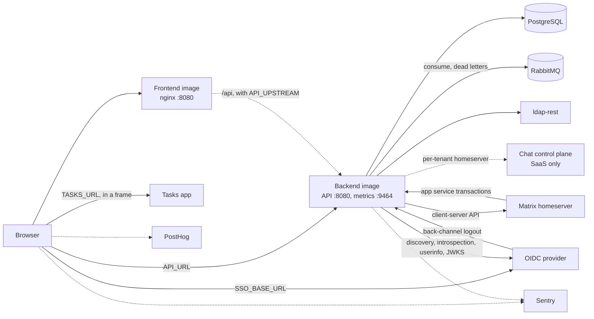

# Deploying and operating Twake Space

Twake Space ships as two container images:

- The frontend image serves the single page app with nginx.
- The backend image runs the Node.js API, the RabbitMQ consumer and the background jobs.

## Runtime dependencies

## Images and CI

Both images go to `ghcr.io/<repository owner>/twake-space-frontend` and `ghcr.io/<repository owner>/twake-space-backend`. The workflows run per app, triggered by changes under `apps/<app>/` and the shared root files.

- Pull request: runs the app's check (`npm audit`, then `npm run check`, which lints, checks formatting, typechecks, tests and builds) and builds the image without pushing. The backend tests run against a `postgres:18` container.
- Push to `main`: runs the check, then builds and pushes the image tagged `latest`.
- Tag `frontend-vX.Y.Z` or `backend-vX.Y.Z`: verifies the tag (the commit is on `main`, the version is greater than the previous release, and it matches the app's `package.json`), runs the check, pushes the image tagged with the version and `latest`, then creates a GitHub release with generated notes.

The image build in CI runs `apps/<app>/docker/smoke-test.sh`. Both apps start their image as in production (read-only root filesystem, all capabilities dropped):

- Frontend (uid 101, `/tmp` as tmpfs): checks the served files, cache headers, CSP and logs.
- Backend (uid 1000), next to Postgres, RabbitMQ and a stub OIDC issuer: checks readiness, liveness, the queue's arguments, migrations, an unauthenticated API call, metrics, and a clean stop on `SIGTERM`.

## Frontend

The frontend image builds the app with Node 24 and serves it from `nginxinc/nginx-unprivileged:1.31-alpine`.

- Runs as uid 101 and listens on port 8080.
- Supports a read-only root filesystem. It needs a writable `/tmp`, where the entrypoint script writes `/tmp/nginx` and nginx keeps its temporary files and pid.
- Docker `HEALTHCHECK` fetches `http://127.0.0.1:8080/healthz`.

### Served paths

- `/healthz` answers `200 ok`, not logged.
- `/.env.js` is the runtime configuration, sent with `Cache-Control: no-store`. `index.html` loads it before the app.
- `/static/` holds the hashed assets, sent with `Cache-Control: public, max-age=31536000, immutable`.
- Any other path falls back to `index.html`, sent with `Cache-Control: no-cache`.

### Runtime configuration

The entrypoint script `40-twake-space-runtime.sh` reads the environment at container start. Each variable below that is set and non-empty becomes a `var NAME = "value"` line in `/.env.js`. A value must fit on one line, or the container refuses to start.

- `API_URL`: the backend base URL, absolute or relative to the page origin. Required: the app throws at startup without it. With `API_UPSTREAM`, set it to `/api`.
- `SSO_BASE_URL`, `SSO_CLIENT_ID`, `SSO_SCOPE`, `SSO_REDIRECT_URI`, `SSO_POST_LOGOUT_REDIRECT`: the OIDC login settings. All five are required: the app throws without any of them.
- `TASKS_URL`: the Tasks app, embedded in a frame. Optional.
- `SENTRY_DSN`, `SENTRY_ENVIRONMENT`: browser error reporting. Optional.
- `POSTHOG_KEY`, `POSTHOG_HOST`: written to `/.env.js`. See the open questions.

`API_UPSTREAM` is optional and not written to `/.env.js`. It is the backend's bare origin, for example `http://twake-space-backend.ns.svc.cluster.local`. nginx then forwards `/api/<path>` to `<API_UPSTREAM>/<path>`, so the browser reaches the API on the page's own origin. Use the full service name: nginx does not apply the search domains. Without it, `/api/` answers 404.

### Security headers

The script also writes the security headers, sent on every path except `/healthz`.

- `Content-Security-Policy` has a fixed part: `default-src 'self'; script-src 'self'; style-src 'self' 'unsafe-inline'; img-src 'self' data: blob:; font-src 'self' data:; object-src 'none'; base-uri 'self'; form-action 'self'`. `style-src` allows inline styles because MUI injects its styles at runtime.
- `connect-src` is `'self'` plus the origin of each of `API_URL`, `SSO_BASE_URL`, `POSTHOG_HOST` and `SENTRY_DSN` that is an absolute `http` or `https` URL. The origin drops the user info, so the Sentry public key stays out of the header. `CSP_CONNECT_SRC` appends more sources.
- `frame-src` is `CSP_FRAME_SRC` (default `'self'`) plus the origin of `TASKS_URL` when set.
- `frame-ancestors` is `CSP_FRAME_ANCESTORS` (default `'self'`). Set it when another app embeds Twake Space.
- `Permissions-Policy` is `PERMISSIONS_POLICY`, by default `accelerometer=(), geolocation=(), gyroscope=(), magnetometer=(), payment=(), usb=()`.
- `X-Content-Type-Options: nosniff` and `Referrer-Policy: same-origin` are fixed.

The CSP variables must not contain double quotes, backslashes, dollar signs, semicolons or commas, so they cannot add directives. `PERMISSIONS_POLICY` follows the same rule, commas allowed.

### Logs

nginx writes access logs to stdout and errors to stderr. The access log leaves out the query string, because the OIDC callback carries the code and state in it. `/healthz` and `/static/` are not logged.

## Backend

The backend image runs `node --import ./dist/instrument.js dist/main.js` on Node 24, as uid and gid 1000, with `NODE_ENV=production`. It exposes port 8080 (API) and 9464 (metrics). It has no Docker `HEALTHCHECK`; use the health endpoints below.

### Configuration

The backend reads its configuration from environment variables only, and refuses to start when one is invalid, listing every problem. There is no support for reading secrets from files: inject them as environment variables.

Required:

- `DATABASE_URL`: a `postgres://` or `postgresql://` URL.
- `AMQP_URL`: an `amqp://` or `amqps://` URL to RabbitMQ, with the user and password. Use `amqps://` for TLS; `NODE_EXTRA_CA_CERTS` adds a private CA.
- `LDAP_REST_URL`: an `http` or `https` URL.
- `LDAP_REST_SERVICE_ID`: the service id for HMAC authentication to ldap-rest.
- `LDAP_REST_SECRET`: the HMAC secret, at least 32 characters.
- `OIDC_ISSUER`: an `https` issuer URL.
- `OIDC_CLIENT_SECRET`: the backend's client secret at the OIDC provider.

Optional, with defaults:

- `OIDC_CLIENT_ID`: default `twakespace-backend`.
- `OIDC_AUDIENCE`: the audience access tokens must carry, default `twakespace`.
- `HTTP_HOST`: default `0.0.0.0`, used by both the API and the metrics server.
- `HTTP_PORT`: API port, default `8080`.
- `METRICS_PORT`: metrics port, default `9464`. Keep it off the public network.
- `LOG_LEVEL`: `fatal`, `error`, `warn`, `info`, `debug` or `trace`, default `info`.
- `MATRIX_LOCALPART`: `uid` or `email`, default `uid`. It tells the backend how Matrix user localparts map to directory users.
- `SENTRY_DSN`, `SENTRY_ENVIRONMENT`: error reporting. Unset `SENTRY_DSN` disables it.

Matrix homeserver, in one of two modes. Without either, the backend runs but posts nothing to Matrix.

- Single installation: set all of `MATRIX_HOMESERVER_URL`, `MATRIX_SERVER_NAME`, `MATRIX_AS_TOKEN` and `MATRIX_HS_TOKEN`. This one homeserver serves every organization.
- SaaS: set both `CHAT_CONTROL_PLANE_URL` and `CHAT_CONTROL_PLANE_TOKEN`. The control plane gives each organization its homeserver.
- Both modes need `SECRETS_KEY`: 32 random bytes in base64. The backend encrypts the homeserver tokens with it (AES-256-GCM) before storing them in Postgres. Changing it makes the stored tokens unreadable.
- Setting only part of a group, or both groups, is a configuration error.

### RabbitMQ names

The defaults match the platform. [Events](events.md#consuming-rabbitmq) lists the bindings they produce.

- `AMQP_QUEUE`: the queue, default `twake-space`. The dead letter queue is `<queue>.dlq`.
- `AMQP_DEAD_LETTER_EXCHANGE`: default `<queue>.dlx`.
- `AMQP_DELIVERY_LIMIT`: deliveries before RabbitMQ dead-letters a message, default `20`.
- `AMQP_SPACE_EXCHANGE`, `AMQP_B2B_EXCHANGE`, `AMQP_ADMIN_PANEL_EXCHANGE`: the platform exchanges, default `space`, `b2b` and `admin-panel`.
- `AMQP_ACTIVITY_EXCHANGE`: the exchange the apps publish their activity on, default `activity`.
- `AMQP_EVENTS`: JSON that moves single events to another exchange or routing key, such as `{"dns.validated": {"exchange": "dns", "routingKey": "domain.dns.validated"}}`. An event the backend has no handler for, a routing key with `*` or `#`, two events on the same exchange and key, or an event on the activity exchange is a configuration error.

RabbitMQ refuses to redeclare a queue with other arguments, and the queue name, the dead letter exchange, the first `space` event's binding and the delivery limit are arguments. Changing one of them means deleting the queue first, after it has drained. Bindings an older version or setting left on the queue stay until it is deleted.

### Startup

The backend starts in this order. A failure at any step stops the process.

1. Validates the configuration.
2. Applies the database migrations.
3. In single installation mode, writes the homeserver settings to the database and links every organization to it.
4. Runs OIDC discovery on `OIDC_ISSUER` (5 second timeout).
5. Opens the Postgres `LISTEN` channels for live updates and session revocations.
6. Starts the API and metrics servers.
7. Connects to RabbitMQ, checks the exchanges other services own, declares its queue, bindings and dead letter queue, and starts consuming.
8. Starts the background jobs and reports ready.

On `SIGTERM` or `SIGINT` it reports not ready, stops the jobs and closes the RabbitMQ connection, after waiting up to 5 seconds for the message in its handler. A message still unacknowledged then is delivered again. After 5 seconds, so the load balancer has moved traffic away, it closes both servers and the Postgres pool, then flushes Sentry. It exits with code 1 when this fails or takes over 25 seconds, which fits the default 30 second grace period. A signal during startup exits at once.

### Database migrations

Migrations run at every startup, from the `apps/backend/drizzle` folder shipped in the image, with the Drizzle migrator. There is no separate migration job. Replicas take a Postgres advisory lock first, so one migrates at a time and the others wait, then find nothing left to apply. Developers generate new migrations with `npm run db:generate` (drizzle-kit).

### Health

On the API port:

- `GET /health/live` answers `503 {"status":"unavailable"}` when the RabbitMQ connection is down or one message has been in its handler for over 5 minutes, `200 {"status":"ok"}` otherwise. Restarting the pod is the fix for both.
- `GET /health/ready` answers `200` when startup has finished and `select 1` succeeds on Postgres, `503 {"status":"unavailable"}` otherwise. It turns `503` as soon as shutdown starts.

Health requests are not logged. The metrics port answers `/health/live` and `/health/ready` too, but its readiness is always `200`: probe the API port.

### Metrics

`GET /metrics` on `METRICS_PORT` returns Prometheus text format, described in [api.md](api.md). Worth alerting on:

- `twake_space_cards_waiting{organization="<id>"}` growing: cards are not reaching Matrix. Organizations with nothing waiting report 0, so alerts resolve.
- `twake_space_cards_failed{organization="<id>"}` above 0: the homeserver refused cards for good.
- `twake_space_parked_events` growing: events wait for a space or member the platform never announced.

### Logs and Sentry

- Logs are JSON lines from pino on stdout, at `LOG_LEVEL`. RabbitMQ client logs carry `component: "amqp"`, at `warn` and above. An `access_token` in a logged URL is replaced by `[redacted]`.
- Sentry is initialised before the app loads, so it instruments Fastify and pino. Log lines at `error` and `fatal` go to Sentry as errors. An unhandled promise rejection stops the process, as it does without Sentry.
- ldap-rest calls time out after 5 seconds, Synapse and control plane calls after 10.

## What the backend reaches

### PostgreSQL

- Holds all state and the migrations.
- Uses `LISTEN` and `NOTIFY` for live updates and session revocations across replicas.
- Uses advisory locks so only one replica runs the hourly purge and the single installation homeserver setup at a time.
- The hourly purge deletes feed events, messages and reactions after 365 days, notifications after 90 days, and Matrix app service transactions after 7 days.

### RabbitMQ

- The `space`, `b2b` and `admin-panel` exchanges must exist before the backend starts, or it stops. Their owners declare them; compose declares them locally. These and the names below are the defaults: see [RabbitMQ names](#rabbitmq-names).
- The backend declares the `activity` exchange, its `twake-space` quorum queue with the bindings, the `twake-space.dlx` exchange and the `twake-space.dlq` queue. Its user needs configure, write and read permissions on those.
- The queue has a single active consumer, so only one replica consumes at a time. The others take over when it goes away.
- An event the backend cannot process ends in `twake-space.dlq`. See [Events](events.md#consuming-rabbitmq).
- A message that fails for over 25 minutes is logged as an error. RabbitMQ's `consumer_timeout` (30 minutes by default) then closes the channel and delivers it again. After 21 deliveries (about 10 hours of failures, less with restarts) RabbitMQ dead-letters it to `twake-space.dlq` and the queue moves on.

### ldap-rest

The directory: organizations, users, groups and technical accounts. Calls are authenticated with HMAC (`LDAP_REST_SERVICE_ID`, `LDAP_REST_SECRET`). The backend does not call it at startup, only while serving requests and events.

### OIDC provider

- Discovery at startup, and the provider must publish a `jwks_uri`.
- Token introspection and userinfo for each access token, authenticated with client secret basic. The token must carry `OIDC_AUDIENCE`. Userinfo must return `sub`, `uuid`, `email` and `sid`, and `org_id` for organization users.
- The provider calls `POST /auth/backchannel-logout` on the API port with a logout token, signed with its JWKS and addressed to `OIDC_AUDIENCE`.

### Matrix homeserver

- The backend posts feed cards and joins rooms through the client-server API (`/_matrix/client/v3/...`) with the app service token, 10 second timeout. The poster runs every second, only when a homeserver or control plane is set.
- The homeserver pushes app service transactions to `PUT /_matrix/app/v1/transactions/:txnId` on the API port, authenticated with the homeserver token (bearer header or `access_token` query). The homeserver must reach the backend.

### Chat control plane (SaaS)

`GET <CHAT_CONTROL_PLANE_URL>/deployment/<organizationId>/twake-space` with the bearer token, 10 second timeout, when the backend first meets an organization and on `chat.deployment.completed` platform events. A `404` means the organization has no chat deployed yet.

## Local stack

`docker compose up` starts RabbitMQ (declaring the `space`, `b2b` and `admin-panel` exchanges) and Postgres. The RabbitMQ management UI is on `http://localhost:15672` (`guest` / `guest`). `docker compose --profile app up` also builds and runs both images. The frontend runs read-only with a tmpfs `/tmp`, as in production. Compose has no ldap-rest or SSO: see [Backend development](backend-dev.md#run-it).

## Open questions

- @rezk2ll The entrypoint writes `POSTHOG_KEY` and `POSTHOG_HOST` to `/.env.js` and adds `POSTHOG_HOST` to `connect-src`, but the frontend source does not read either. Is PostHog planned, or should the script drop them?
- @rezk2ll `twake-space.dlq` has no length limit or TTL. Who watches it, and should it get a limit?
- @rezk2ll Several replicas start together and each runs the migrations. Does the Drizzle migrator lock against concurrent runs, or should one replica (or a job) migrate first?
- @rezk2ll The backend relies on Postgres `LISTEN`. Is a transaction pooling proxy (PgBouncer) in front of Postgres ruled out for deployments?
- @rezk2ll CI builds the images without a `platforms` setting. Is an arm64 image needed?
- @rezk2ll Both a push to `main` and a release tag move `latest`. Should deployments pin version tags only?
