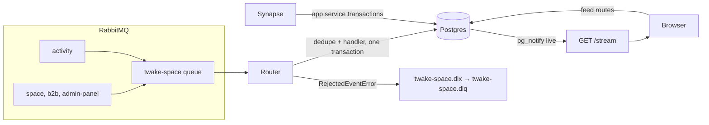
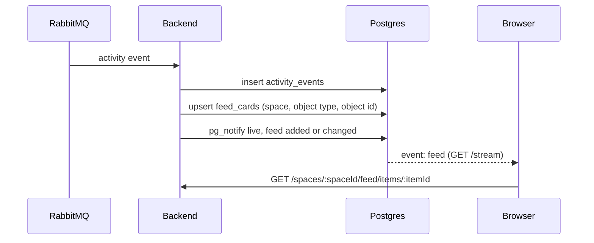
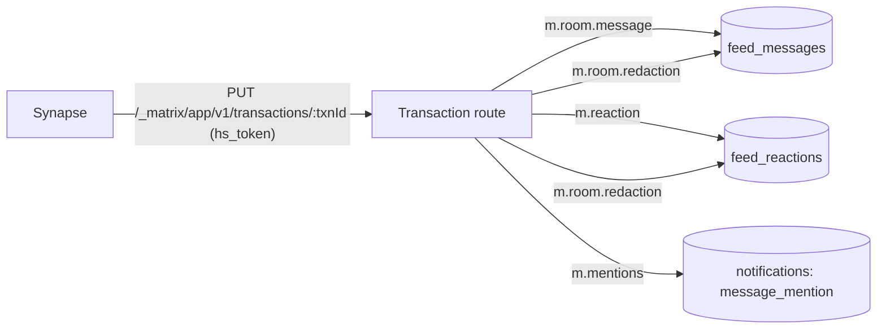
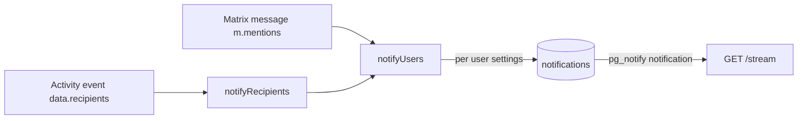
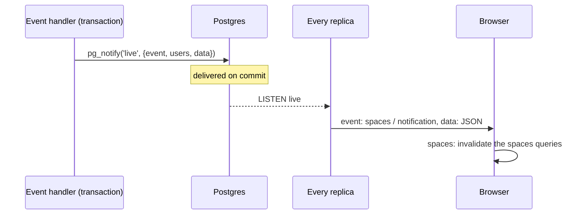

# Events

How events reach Twake Space, what the backend does with them, and how the result reaches the browser.

## Terms

- Platform event: a RabbitMQ message from ldap-rest or another platform service (exchanges `space`, `b2b`, `admin-panel`, `settings`). It has a routing key, a message id, and a JSON body.
- Activity event: a CloudEvent (specversion `1.0`) an app publishes on the `activity` exchange, with the CloudEvent `type` as routing key.
- Copy: the backend's Postgres copy of organizations, spaces, members, linked groups and resources.
- Card: a space feed item showing the activity events about one object, stored in `feed_cards` and pointing at the object's latest event in `activity_events`.
- Post: a space feed item a member writes, stored in `feed_posts`.
- Live event: a message the backend pushes to a browser over SSE: `spaces`, `notification`, `settings` or `feed`.

## Overview

## Consuming RabbitMQ

The backend consumes one queue, `twake-space`, through [@linagora/rabbitmq-client](https://github.com/linagora/rabbitmq-client/tree/v0.6.0). At startup it declares the queue and binds it to each platform event it handles, routing key equal to the event name:

- `space`: `twake.space.created`, `twake.space.updated`, `twake.space.deleted`, `twake.space.member.added`, `twake.space.member.role.changed`, `twake.space.member.removed`, `twake.space.group.linked`, `twake.space.group.role.changed`, `twake.space.group.unlinked`
- `b2b`: `b2b.group.updated`, `b2b.member.role.changed`, `b2b.member.disabled`, `domain.user.deleted`, `domain.organization.deleted`, `chat.deprovision`, `chat.deployment.completed`
- `admin-panel`: `dns.validated`
- `settings`: `user.settings.updated`
- `activity`: `#`

The queue:

- Is a quorum queue with a single active consumer and a delivery limit of 20. Each replica consumes with prefetch 1, so messages are handled one at a time, in the order they were published.
- Dead-letters to the `twake-space.dlx` exchange, which routes to the `twake-space.dlq` queue. The backend declares both.
- Gets each message acknowledged only after its Postgres transaction commits.

Startup fails when `space`, `b2b` or `admin-panel` is missing, since other services own them. The backend declares `activity` and `settings` itself, as durable topic exchanges: the apps declare `activity` the same way, and declaring `settings` lets the backend run on a platform without common settings.

Every name above is a setting, listed in [Deploying](deploy.md#rabbitmq-names). The router, the handlers and the `parked_events` rows always see the default names: the consumer translates a renamed exchange or routing key back before routing.

Local `docker-compose.yml` runs RabbitMQ and declares the three exchanges the backend only checks.

## Routing

The router picks a handler by exchange:

- `activity`: the key is the CloudEvent `type`. The dedupe key is `{ source, id }` of the CloudEvent.
- Any other exchange: the key is the routing key. The dedupe key is `{ source: 'amqp', id: messageId }`.

Each message ends in one outcome:

- processed: the handler ran.
- duplicate: `processed_events` already holds `(consumer, source, id)`, so the handler did not run.
- unrouted: no handler for the key. Logged at debug and acknowledged.
- malformed: a CloudEvent that does not parse, a platform event without a message id, or a handler threw `MalformedEventError`. Logged and acknowledged. A body that is not JSON goes to the dead letter queue.
- rejected: a handler threw `RejectedEventError`, or Postgres refused the event's data (an error of class 22 or 23, such as a NUL byte in a preview). The message is dead-lettered to `twake-space.dlq`. It carries RabbitMQ's `x-death` header but no reason: the `event rejected` log line has it.
- parked: a handler threw `NotYetKnownError`, because the event is about a space or member the copy does not hold yet. The event goes to the `parked_events` table and is acknowledged. One replica retries parked events every 5 seconds. One still waiting after 5 minutes is published through `twake-space.dlx` to `twake-space.dlq`, with the headers `x-twake-space-exchange`, `x-twake-space-routing-key` and `x-twake-space-reason`.
- failed: any other error, such as Postgres being down. The message stays unacknowledged and is retried in the process, 1 second after the first failure, doubling up to a minute. Nothing behind it is handled meanwhile. After 25 minutes of failures the backend logs an error, because RabbitMQ's `consumer_timeout` (30 minutes by default) then closes the channel and delivers the message again. Each such redelivery, like one after a restart, counts toward the delivery limit: once a message has been delivered 21 times (about 10 hours of failures), RabbitMQ sends it to `twake-space.dlq` and the queue moves on.

The dedupe claim and the handler run in the same Postgres transaction, so a handler failure releases the claim.

## Ordering

- Events can arrive out of order or be replayed. `last_changes` keeps, per object key, the time of the last change applied.
- A change applies only if its time is at or after the stored one. An event without a time applies to every object.
- `last_changes` rows stay after the object is removed, so a replayed older event cannot bring it back.
- Object keys look like `space:<id>`, `space:<id>:name`, `space:<id>:member:<user>`, `space:<id>:group:<group>`, `space:<id>:resource:<kind>`, `organization:<id>:chat`, `organization:<id>:member:<user>`, `user:<uuid>:deleted`, `email:<email>:deleted`.
- A removal records the member's key even when the copy does not hold them yet, so their older addition stays out.
- A deleted user, matched by uuid or email, is not added back by an older member or role event. A newer one adds them, since an email can be given to a new user.
- A group's newest name is kept in `group_names` even while no space links it, so a link older than a rename takes the new name.

## Platform events

### Meeting organizations

Every platform handler is wrapped: when the body has an `organizationId` the copy does not know yet, the backend reads it once from the directory (ldap-rest) and inserts it with its `domain`, `chatAvailable` and `mailAvailable`. If the directory does not know it, a warning is logged and the handler still runs.

- In a single installation, the organization points to the one configured homeserver.
- In SaaS, the backend asks the chat control plane (`GET deployment/<organizationId>/twake-space`) for the tenant's homeserver and stores it, tokens encrypted. A 404 means chat is not deployed yet. When the control plane fails, the event still runs and the organization keeps no homeserver; on `chat.deployment.completed` the event is parked and retried instead.

### Organization availability

- `chat.deployment.completed`: sets chat available at `deployment.completedAt`, then refreshes the tenant's homeserver. A `status` other than `succeeded` is logged and ignored.
- `chat.deprovision`: sets chat unavailable at `timestamp`.
- `dns.validated`: sets mail available to `mailDnsConfigurationValidated`. It has no time, so the last one handled wins.

### User settings

`user.settings.updated` comes from Twake Workplace common settings. Each message holds all of a person's settings after a change.

- It is stored by the person's lowercased `payload.email`, the only key common settings and TwakeSpace share. A message without an email is dropped.
- A `version` at or below the stored one is dropped. A newer one replaces the stored settings whole. Versions count per common settings account, so a message from another `nickname` behind the same email replaces them whatever its version.
- Only what the UI applies is kept: `language`, `timezone`, `theme` (`light`, `dark` or `auto`), `avatar` and `display_name`. A value of another type is left out.
- Common settings publishes without a message id, so the body's `request_id` stands in for it. A republish of the same version gets a new `request_id`, and the version check drops it.
- A stored change sends a `settings` live event to the person's open streams. `GET /settings` gives the caller theirs, with `null` for anything not set.
- TwakeSpace never calls the common settings API. A person it has had no message about gets the browser's defaults until their settings change, or until an admin republishes everyone with common settings' `POST /api/admin/user/settings/sync`.

The browser reads `GET /settings` once signed in, and applies the answer when it comes. Until then, or when the read fails, the app keeps its own defaults and the theme it last had.

- The language is the one set if TwakeSpace has it, else the browser's.
- The theme is the one set. `auto`, or nothing set, follows the system.
- Dates and the greeting use the timezone set, or the browser's when it is unknown.
- The account menu shows the display name and avatar set, else the name from sign-in and its initials. The greeting uses the same name. Other people keep their directory names.

### Space copy

- `twake.space.created`: inserts the space, its members and its linked groups.
- `twake.space.updated`: renames the space. A rename of a space not created yet is parked until the creation arrives, and a rename of a deleted space is dropped.
- `twake.space.deleted`: removes the space, its members, groups and resources, records their keys in `last_changes`, and drops the space from API tokens.
- `twake.space.member.added`, `twake.space.member.role.changed`: upsert members.
- `twake.space.member.removed`: removes members.
- `twake.space.group.linked`, `twake.space.group.role.changed`: upsert linked groups.
- `twake.space.group.unlinked`: removes linked groups.
- `b2b.group.updated`: renames the group in every space.
- `b2b.member.role.changed`: upserts the person's organization role.
- `b2b.member.disabled`: revokes the account's tokens in that organization.
- `domain.user.deleted`: deletes the person's notifications and reactions, turns them into `deleted_user` on stored cards and posts, revokes their tokens, and removes them from every space and organization.
- `domain.organization.deleted`: revokes the organization's tokens.

A person sent without a `uuid` (ldap-rest lifecycle events carry none) is matched in the copy by email, among space members and then among the organization roles (in the event's organization when it names one). `b2b.member.disabled` also falls back to the username, among space members only: organization roles hold no username.

Upserts and removals of members, groups and names send a `spaces` live event to the members concerned.

## Activity events

### Resources provisioned by apps

`com.twake.<app>.space.provisioned.v1` records the app's resource for a space (`data.space_id`, `data.resource.kind`, `data.resource.id`):

- `drive` -> `drive`
- `mail` -> `mailbox`
- `calendar` -> `calendar`
- `chat` -> `matrix_space` (the space's Matrix room id)
- `tasks` -> `project` (the Tasks project id)

- It needs `twakeorg`, and rejects the event when that is not the space's organization.
- It upserts `space_resources`, so a new id replaces the old one, and sends a `spaces` live event to the space's members.
- It parks an event for a space the copy does not hold yet, and ignores one for a space deleted after the event's `time`.

### Activity that becomes a card

Any other `com.twake.<app>.*` type is stored as a card for these apps:

- mail -> `messages`
- drive -> `files`
- calendar -> `events`
- meet -> `activities`
- tasks -> `activities`

Chat makes no card: its messages are already in Matrix. A chat type other than `space.provisioned` has no handler and is unrouted.

The CloudEvent fields the handler reads:

- `twakeorg`: the organization, absent for a B2C user.
- `twakeactorid`, `twakeactor`: the acting user's uuid and email.
- `data.object`: `type`, `id`, `title`, and an optional `container` (`kind`, `id`): the app's own resource the object lives in. Apps send ids, never a link.
- `data.preview`: optional text, cut to 280 characters.
- `data.state`: optional, an object the card passes to the browser as is, such as a calendar event's time. The card shows the latest event's, so an app sends the whole state on every event.
- `data.actor`: `{ type: 'token', id, name }` when an API token acted.
- `data.recipients`: who to notify (see Notifications).

The actor stored on the card is one of:

- `{ type: 'token', id, name }` from `data.actor`.
- `{ type: 'user', id, email }` from `twakeactorid`, or found by email among space members (`id` is null when no member has that email).
- `{ type: 'deleted_user' }` once the user is deleted.
- null when the event names no actor.

The space is the one whose resource of that kind has the container's id. An app publishes a resource's provisioned event before any activity on it, and both reach the same queue in that order, so a container no space has belongs to a person: the card is for personal notifications only. A container held only by another organization's space is rejected to the dead letter queue. A user actor with a uuid who is not a member may only mean the platform event that adds them has not arrived yet, so the event is parked. An actor sent by email only that no member has is kept as is: someone outside the space, such as an attendee replying to a team calendar event. A parked event is handled after the events that came after it in the queue. A space with linked groups accepts a non member actor with a warning, since the copy does not hold group members.

The card stores everything in `data` except `recipients`.

## The feed

- A space's feed is its cards and its posts, newest first. The routes are in the [HTTP API](api.md#feed).
- A card exists per object: space, `object.type` and `object.id`. Its time is the object's first event, so later events change the card without moving it. It shows the latest event (by CloudEvent `time`) whatever order the events arrive in.
- An event in no space makes no card. It exists for personal notifications only.
- Posts are plain text, from editors and admins. Their authors edit and delete them. Every member reacts to cards and posts.
- Each new or changed card, post or reaction sends a `feed` live event to the space's members.
- Nothing is posted to Matrix: the poster that sent cards to the space's Matrix room is off.

## Matrix events back into Postgres

- Synapse authenticates with its `hs_token` (bearer or `access_token` query). The backend finds the homeserver by the token's hash.
- A transaction id already seen for that homeserver is answered `{}` without processing.
- Events are matched to a space by room id against the `matrix_space` resources of the homeserver's organizations. Events in other rooms are ignored.
- `m.room.message` is stored. An `m.replace` edit updates the original if it is in the same space, the sender matches and it is newer.
- `m.reaction` with `m.annotation` is stored with its space.
- `m.room.redaction` marks the redacted message or reaction of the same space (`redacts` at the top level or, for room v11, in the content).
- A malformed event, or one Postgres refuses to store, is skipped so Synapse does not resend the batch forever.

## Notifications

### From activity events

Each entry in `data.recipients` is `{ uuid?, email, reason }`. The reason sets the notification type:

- `mentioned` -> `card_mention`
- `invited` -> `invitation`
- `attendee` -> `attended_event_change`
- `member` -> `space_change`

- An invalid entry is skipped with a warning; the card is still stored.
- A recipient without a `uuid` is found by email among the people the copy holds in the event's organization (space members of its spaces, and organization roles), or skipped.
- A recipient whose `uuid` the copy holds only in other organizations is skipped. A `uuid` the copy does not hold at all is notified, since the copy does not hold every member of an organization.
- Tasks events (`com.twake.tasks.*`) notify no one: Twake Tasks notifies its own users.

### From Matrix mentions

A new `m.room.message` notifies each user in `m.mentions.user_ids` who is on the same homeserver, is not the sender, and is a member of the space. The Matrix localpart is matched to the member's username (`MATRIX_LOCALPART=uid`, the default) or to the part of their email before `@` (`email`).

### Settings and delivery

- Every type is on by default except `space_change`. A row in `notification_settings` is the user's choice.
- A notification row points to either an activity event or a Matrix event, never both. A user gets one notification per type and source.
- Each inserted notification sends a `notification` live event to its user.
- The API: `GET /notifications` (paged, with the unread count and the card's type, category, actor, content and time), `POST /notifications/read`, `POST /notifications/:id/read`, `GET` and `PUT /notifications/settings`.

## Live updates

- Handlers call `pg_notify` on the `live` channel inside their transaction, so replicas only hear about committed changes. One notify carries up to 100 users, to stay under the payload limit.
- Every replica listens and writes the event to each open stream of the listed users. A `settings` event names an email instead, and goes to the streams of sessions with that email.
- `GET /stream` needs a session. It is `text/event-stream`, sends a heartbeat comment every 25 seconds, and closes when the session expires, when the session is revoked, or when the server stops.
- The frontend reads it with `fetch` (EventSource cannot send the bearer token) and reconnects with a backoff from 1 to 30 seconds.
- On `spaces`, the frontend invalidates its spaces queries, and on `settings` it reads the settings again. On a reconnect it invalidates every query, since events sent while the stream was closed are lost.

## The feed in the browser

- The browser signs in to the organization's Synapse through SSO with its own device, and syncs with matrix-js-sdk.
- Each filter is one Synapse filter on event types over the Matrix space:
  - all: `m.room.message` and the four `com.twake.feed.*` types
  - messages: `m.room.message` and `com.twake.feed.messages`
  - files, activities, events: their `com.twake.feed.*` type only
- An event becomes a feed entry:
  - `m.room.message` with a string `body` -> a message.
  - `com.twake.feed.<category>` with an `object` holding string `type`, `id`, `title` -> a card with its `actor` (when it has a known `type`) and `preview` (when it is a string).
  - An `m.replace` event is not an entry. The SDK gives each event the content of its latest edit, so the first card about an object shows the latest content.
- A card's title opens the space's tab for its container: `project` -> Tasks, `drive` -> Drive, `mailbox` -> Mail, `calendar` -> Calendar, `matrix_space` -> Chat. With no container, or a tab the space does not show, the title is plain text.
- After a gap in the sync the timeline resets; the feed then loads older entries again.

## Retention

A purge runs at startup and every hour, under an advisory lock so one replica purges at a time:

- `activity_events`, `feed_messages`, `feed_reactions`, `feed_item_reactions`: 365 days after they were stored. A card goes with its latest event.
- `feed_posts`: 365 days after they were written. Their reactions go with them.
- `notifications`: 90 days.
- `app_service_transactions`: 7 days.

The purge does not touch the copy, `processed_events` or `last_changes`, nor the events already posted in Matrix.

## References

- [ADR 002](https://github.com/linagora/twake-space-architecture/blob/afb2563b2b6a2fefb24689f25244166999fad7d7/ADR002.md), [ADR 003](https://github.com/linagora/twake-space-architecture/blob/7836d545988709576c54c204a8297f994772035d/ADR003.md), [ADR 005](https://github.com/linagora/twake-space-architecture/blob/487eba8d55e3101e397b12b203c69b01969d4a31/ADR005.md), [ADR 009](https://github.com/linagora/twake-space-architecture/blob/3c65232937bedc6305b0ea78cde6a3520753532e/ADR009.md)
- [ADR 007](https://github.com/linagora/twake-space-architecture/blob/30942714a78bec539322ed86e05c48cd08817e93/ADR007.md), [ADR 008](https://github.com/linagora/twake-space-architecture/blob/30ee2e5bac081e8bee73d82655724aaa1ac1c704/ADR008.md)

## Open questions

- @rezk2ll In SaaS, which exchange carries `chat.deployment.completed`? The queue binds it on `b2b` for now (ADR 008 leaves it open).
- @rezk2ll The frontend ignores the `notification` live event and has no notifications view yet. Is that planned under #90?
- @rezk2ll `processed_events` and `last_changes` grow without a purge. Is that intended?
- @rezk2ll A recipient `uuid` the copy does not hold is notified, because the copy has no full list of an organization's members. Should the backend check it against the directory instead, or should apps only name people of the event's organization?
- @rezk2ll An actor outside the space (an email no member has) shows with no name. Should the card show their email, which the team calendar already shows to its members?
