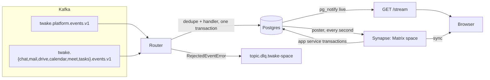
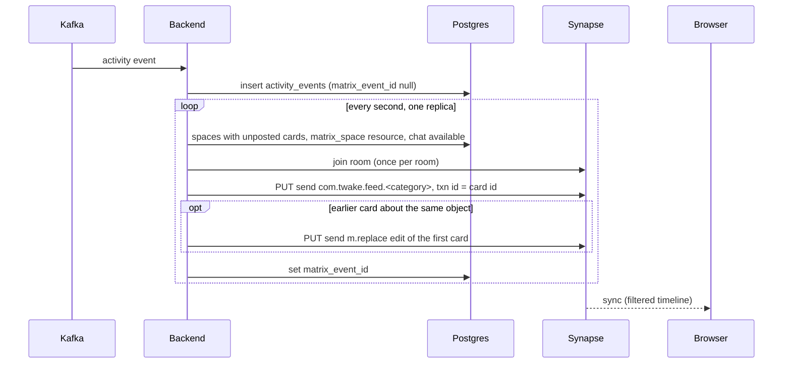
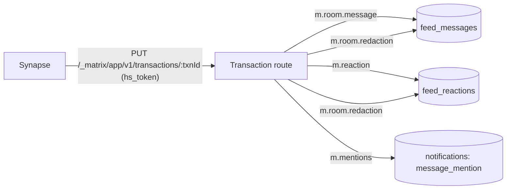
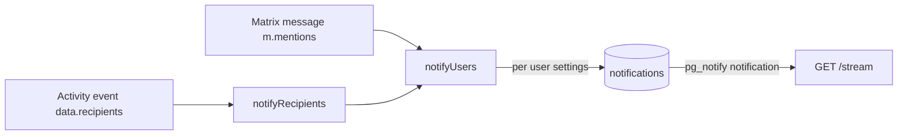
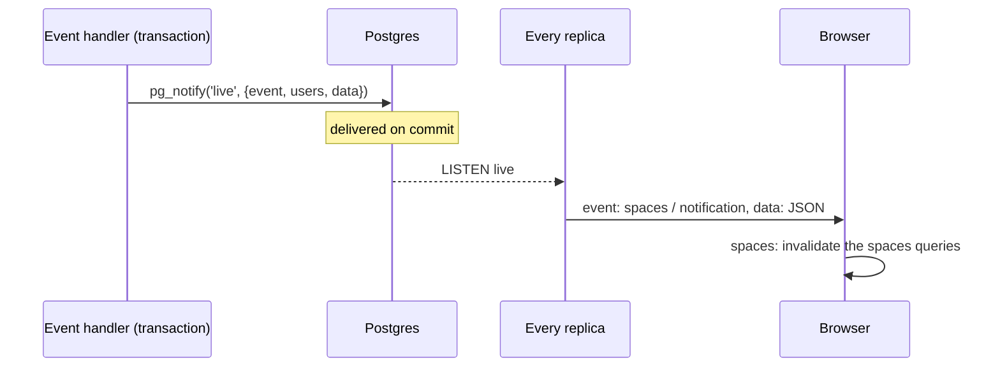

# Events

How events reach Twake Space, what the backend does with them, and how the result reaches the browser.

## Terms

- Platform event: a message on `twake.platform.events.v1`. It carries an AMQP routing key and message id as Kafka headers, and a JSON body.
- Activity event: a CloudEvent (specversion `1.0`) on one of the app topics `twake.<app>.events.v1`.
- Copy: the backend's Postgres copy of organizations, spaces, members, linked groups and resources.
- Card: an activity event stored in `activity_events`, then posted to the space's Matrix space as a `com.twake.feed.<category>` event.
- Bot: the application service user. It posts with the homeserver's `as_token`.
- Live event: a message the backend pushes to a browser over SSE, either `spaces` or `notification`.

## Overview

## Consuming Kafka

- One consumer subscribes to the six app topics and the platform topic, with group id `KAFKA_GROUP_ID` (default `twake-space`), from the beginning, with auto commit off.
- After each message is handled, the offset is committed. A handler error that is neither malformed nor rejected propagates, so that offset is not committed.
- Local `docker-compose.yml` creates the seven topics with 3 partitions, and turns off topic auto creation.

## Routing

The router picks a handler by topic:

- Platform topic: the key is the `amqp_routing_key` header. The dedupe key is `{ source: 'amqp', id: amqp_message_id }`.
- App topics: the key is the CloudEvent `type`. The dedupe key is `{ source, id }` of the CloudEvent.

Each message ends in one outcome:

- processed: the handler ran.
- duplicate: `processed_events` already holds `(consumer, source, id)`, so the handler did not run.
- unrouted: no handler for the key. Logged at debug and skipped.
- malformed: unparseable, or a handler threw `MalformedEventError`. Logged and skipped.
- rejected: a handler threw `RejectedEventError`, or Postgres refused the event's data (an error of class 22 or 23, such as a NUL byte in a preview). The message goes to `<topic>.dlq.twake-space` with a `twake-space-reason` header.
- parked: a handler threw `NotYetKnownError`, because the event is about a space or member the copy does not hold yet. The event goes to the `parked_events` table and the partition moves on. One replica retries parked events every 5 seconds, and sends one still waiting after 5 minutes to the dead letter topic.
- failed: any other error, or a failed offset commit. The offset is not committed and the partition pauses, 1 second after the first failure, doubling up to a minute, before the same message comes back. Other partitions keep flowing.

The dedupe claim and the handler run in the same Postgres transaction, so a handler failure releases the claim.

## Ordering

- Events can arrive out of order or be replayed. `last_changes` keeps, per object key, the time of the last change applied.
- A change applies only if its time is at or after the stored one. An event without a time applies to every object.
- `last_changes` rows stay after the object is removed, so a replayed older event cannot bring it back.
- Object keys look like `space:<id>`, `space:<id>:name`, `space:<id>:member:<user>`, `space:<id>:group:<group>`, `space:<id>:resource:<kind>`, `organization:<id>:chat`, `organization:<id>:member:<user>`, `user:<uuid>:deleted`, `email:<email>:deleted`.
- A removal records the member's key even when the copy does not hold them yet, so their older addition stays out.
- A deleted user, matched by uuid or email, is not added back by an older member or role event. A newer one adds them, since an email can be given to a new user.
- A group's newest name is kept in `group_names` even while no space links it, so a link older than a rename takes the new name.

## Platform events

### Meeting organizations

Every platform handler is wrapped: when the body has an `organizationId` the copy does not know yet, the backend reads it once from the directory (ldap-rest) and inserts it with its `domain`, `chatAvailable` and `mailAvailable`. If the directory does not know it, a warning is logged and the handler still runs.

- In a single installation, the organization points to the one configured homeserver.
- In SaaS, the backend asks the chat control plane (`GET deployment/<organizationId>/twake-space`) for the tenant's homeserver and stores it, tokens encrypted. A 404 means chat is not deployed yet. When the control plane fails, the event still runs and the organization keeps no homeserver; on `chat.deployment.completed` the event is parked and retried instead.

### Organization availability

- `chat.deployment.completed`: sets chat available at `deployment.completedAt`, then refreshes the tenant's homeserver. A `status` other than `succeeded` is logged and ignored.
- `chat.deprovision`: sets chat unavailable at `timestamp`.
- `dns.validated`: sets mail available to `mailDnsConfigurationValidated`. It has no time, so the last one handled wins.

### Space copy

- `twake.space.created`: inserts the space, its members and its linked groups.
- `twake.space.updated`: renames the space. A rename of a space not created yet is parked until the creation arrives, and a rename of a deleted space is dropped.
- `twake.space.deleted`: removes the space, its members, groups and resources, records their keys in `last_changes`, and drops the space from API tokens.
- `twake.space.member.added`, `twake.space.member.role.changed`: upsert members.
- `twake.space.member.removed`: removes members.
- `twake.space.group.linked`, `twake.space.group.role.changed`: upsert linked groups.
- `twake.space.group.unlinked`: removes linked groups.
- `b2b.group.updated`: renames the group in every space.
- `b2b.member.role.changed`: upserts the person's organization role.
- `b2b.member.disabled`: revokes the account's tokens in that organization.
- `domain.user.deleted`: deletes the person's notifications, turns them into `deleted_user` on stored cards, revokes their tokens, and removes them from every space and organization.
- `domain.organization.deleted`: revokes the organization's tokens.

A person sent without a `uuid` (ldap-rest lifecycle events carry none) is matched in the copy by email, among space members and then among the organization roles (in the event's organization when it names one). `b2b.member.disabled` also falls back to the username, among space members only: organization roles hold no username.

Upserts and removals of members, groups and names send a `spaces` live event to the members concerned.

## Activity events

### Resources provisioned by apps

`com.twake.<app>.space.provisioned.v1` records the app's resource for a space (`data.space_id`, `data.resource.kind`, `data.resource.id`):

- `drive` -> `drive`
- `mail` -> `mailbox`
- `calendar` -> `calendar`
- `chat` -> `matrix_space` (the room id the bot posts cards to)
- `tasks` -> `tasks`

- It needs `twakeorg`, and rejects the event when that is not the space's organization.
- It upserts `space_resources` and sends a `spaces` live event to the space's members.
- It parks an event for a space the copy does not hold yet, and ignores one for a space deleted after the event's `time`.

### Activity that becomes a card

Any other `com.twake.<app>.*` type is stored as a card for these apps:

- mail -> `messages`
- drive -> `files`
- calendar -> `events`
- meet -> `activities`
- tasks -> `activities`

Chat makes no card: its messages are already in Matrix. A chat type other than `space.provisioned` has no handler and is unrouted.

The CloudEvent fields the handler reads:

- `twakeorg`: the organization, absent for a B2C user.
- `twakeactorid`, `twakeactor`: the acting user's uuid and email.
- `data.object`: `type`, `id`, `title`, `url`, and an optional `space_id`.
- `data.preview`: optional text, cut to 280 characters.
- `data.actor`: `{ type: 'token', id, name }` when an API token acted.
- `data.recipients`: who to notify (see Notifications).

The actor stored on the card is one of:

- `{ type: 'token', id, name }` from `data.actor`.
- `{ type: 'user', id, email }` from `twakeactorid`, or found by email among space members (`id` is null when no member has that email).
- `{ type: 'deleted_user' }` once the user is deleted.
- null when the event names no actor.

When `space_id` is set, the event is rejected to the dead letter topic if the space belongs to another organization. An unknown space or a user actor who is not a member may only mean the platform topic is behind, so the event is parked. A parked event is handled after the events that came after it on its partition. A space with linked groups accepts a non member actor with a warning, since the copy does not hold group members.

The card stores everything in `data` except `recipients`.

## Posting cards to Matrix

- The poster runs every second under a Postgres advisory lock, so one replica posts at a time.
- A space is picked when it has unposted cards, a `matrix_space` resource, and its organization has chat available and a homeserver. Up to 50 spaces per pass, 50 cards per space, oldest first.
- Spaces post in parallel. Within a space, cards go in order and the space stops at its first failure.
- A failing space waits before its next try: 1 second, doubling up to 5 minutes, reset by a pass where all its cards post. Other spaces post meanwhile.
- A card the homeserver refuses for good (400 or 413) gets `post_failed_at`, is not retried, and the next card posts. When only the edit of the first card is refused, the card stays posted and the first card is left as it was.
- The transaction id is the card's `id`, so a retried send does not post twice.
- A card without a `space_id` is never posted. It exists for personal notifications only.
- `twake_space_cards_waiting{organization}` on the metrics port counts unposted cards per organization with chat, and `twake_space_cards_failed{organization}` the refused ones.

### Card content

The event type is `com.twake.feed.<category>`, with `<category>` one of `messages`, `files`, `activities`, `events`. The content:

- `type`: the CloudEvent type.
- `id`: the CloudEvent id.
- `actor`: the stored actor.
- `object`: `type`, `id`, `title`, `url` (and any other field the app sent).
- `preview`: the preview, when sent.
- `state`: `data.state` when the app sent one, else `{}`.
- `body`: the title and the preview, one per line, for Matrix clients that only read `body`.
- `m.mentions`: `{}`.

### Edits

When a card is about an object (same space, `object.type`, `object.id`) that already has a posted card, the bot posts the new card, then edits the first card with the new content (`m.new_content`, `m.relates_to` with `rel_type: m.replace`). The edit uses the first card's event type and the transaction id `<card id>.edit`.

## Matrix events back into Postgres

- Synapse authenticates with its `hs_token` (bearer or `access_token` query). The backend finds the homeserver by the token's hash.
- A transaction id already seen for that homeserver is answered `{}` without processing.
- Events are matched to a space by room id against the `matrix_space` resources of the homeserver's organizations. Events in other rooms are ignored.
- `m.room.message` is stored. An `m.replace` edit updates the original if it is in the same space, the sender matches and it is newer.
- `m.reaction` with `m.annotation` is stored with its space.
- `m.room.redaction` marks the redacted message or reaction of the same space (`redacts` at the top level or, for room v11, in the content).
- A malformed event, or one Postgres refuses to store, is skipped so Synapse does not resend the batch forever.

## Notifications

### From activity events

Each entry in `data.recipients` is `{ uuid?, email, reason }`. The reason sets the notification type:

- `mentioned` -> `card_mention`
- `invited` -> `invitation`
- `attendee` -> `attended_event_change`
- `member` -> `space_change`

- An invalid entry is skipped with a warning; the card is still stored.
- A recipient without a `uuid` is found by email among the people the copy holds in the event's organization (space members of its spaces, and organization roles), or skipped.
- A recipient whose `uuid` the copy holds only in other organizations is skipped. A `uuid` the copy does not hold at all is notified, since the copy does not hold every member of an organization.
- Tasks events (`com.twake.tasks.*`) notify no one: Twake Tasks notifies its own users.

### From Matrix mentions

A new `m.room.message` notifies each user in `m.mentions.user_ids` who is on the same homeserver, is not the sender, and is a member of the space. The Matrix localpart is matched to the member's username (`MATRIX_LOCALPART=uid`, the default) or to the part of their email before `@` (`email`).

### Settings and delivery

- Every type is on by default except `space_change`. A row in `notification_settings` is the user's choice.
- A notification row points to either an activity event or a Matrix event, never both. A user gets one notification per type and source.
- Each inserted notification sends a `notification` live event to its user.
- The API: `GET /notifications` (paged, with the unread count and the card's type, category, actor, content and time), `POST /notifications/read`, `POST /notifications/:id/read`, `GET` and `PUT /notifications/settings`.

## Live updates

- Handlers call `pg_notify` on the `live` channel inside their transaction, so replicas only hear about committed changes. One notify carries up to 100 users, to stay under the payload limit.
- Every replica listens and writes the event to each open stream of the listed users.
- `GET /stream` needs a session. It is `text/event-stream`, sends a heartbeat comment every 25 seconds, and closes when the session expires, when the session is revoked, or when the server stops.
- The frontend reads it with `fetch` (EventSource cannot send the bearer token) and reconnects with a backoff from 1 to 30 seconds.
- On `spaces`, the frontend invalidates its spaces queries. On a reconnect it invalidates every query, since events sent while the stream was closed are lost.

## The feed in the browser

- The browser signs in to the organization's Synapse through SSO with its own device, and syncs with matrix-js-sdk.
- Each filter is one Synapse filter on event types over the Matrix space:
  - all: `m.room.message` and the four `com.twake.feed.*` types
  - messages: `m.room.message` and `com.twake.feed.messages`
  - files, activities, events: their `com.twake.feed.*` type only
- An event becomes a feed entry:
  - `m.room.message` with a string `body` -> a message.
  - `com.twake.feed.<category>` with an `object` holding string `type`, `id`, `title`, `url` -> a card with its `actor` (when it has a known `type`) and `preview` (when it is a string).
  - An `m.replace` event is not an entry. The SDK gives each event the content of its latest edit, so the first card about an object shows the latest content.
- After a gap in the sync the timeline resets; the feed then loads older entries again.

## Retention

A purge runs at startup and every hour, under an advisory lock so one replica purges at a time:

- `activity_events`, `feed_messages`, `feed_reactions`: 365 days after they were stored.
- `notifications`: 90 days.
- `app_service_transactions`: 7 days.

The purge does not touch the copy, `processed_events` or `last_changes`, nor the events already posted in Matrix.

## References

- [ADR 002](https://github.com/linagora/twake-space-architecture/blob/afb2563b2b6a2fefb24689f25244166999fad7d7/ADR002.md), [ADR 003](https://github.com/linagora/twake-space-architecture/blob/7836d545988709576c54c204a8297f994772035d/ADR003.md), [ADR 005](https://github.com/linagora/twake-space-architecture/blob/487eba8d55e3101e397b12b203c69b01969d4a31/ADR005.md), [ADR 009](https://github.com/linagora/twake-space-architecture/blob/3c65232937bedc6305b0ea78cde6a3520753532e/ADR009.md)
- [ADR 007](https://github.com/linagora/twake-space-architecture/blob/30942714a78bec539322ed86e05c48cd08817e93/ADR007.md), [ADR 008](https://github.com/linagora/twake-space-architecture/blob/30ee2e5bac081e8bee73d82655724aaa1ac1c704/ADR008.md)

## Open questions

- @rezk2ll Which component puts AMQP platform messages on `twake.platform.events.v1` with the `amqp_routing_key` and `amqp_message_id` headers?
- @rezk2ll A second card about the same object is posted as a new card and also edits the first one. Should the feed show both, or should the later card only be an edit?
- @rezk2ll The card content carries `state`, which the activity schema does not declare and the frontend does not read. What is it for, and what shape should apps send?
- @rezk2ll The frontend ignores the `notification` live event and has no notifications view yet. Is that planned under #90?
- @rezk2ll `processed_events` and `last_changes` grow without a purge. Is that intended?
- @rezk2ll A recipient `uuid` the copy does not hold is notified, because the copy has no full list of an organization's members. Should the backend check it against the directory instead, or should apps only name people of the event's organization?
