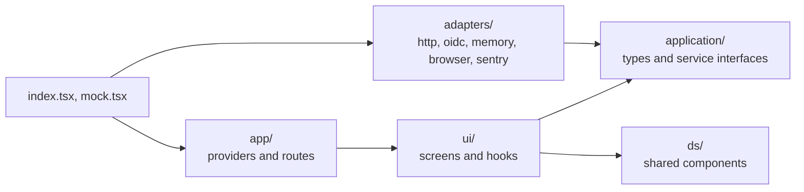

# Frontend development

How to run the Twake Space frontend and where new code goes.

## Run it on seed data

Mock mode needs Node 24 and nothing else: no backend, SSO or homeserver.

```bash
npm ci
npm run dev:mock -w @twake-space/frontend
```

Open http://localhost:3000 (or set `PORT`). You're signed in as Alice Martin, an admin of the organization `acme.twake.local`, and four spaces cover each role and each resource state:

- Roadmap: admin, every app ready, with a feed of messages and cards
- Design Sprint: editor, Drive still being prepared, mail turned off, an empty feed
- B2B Admin Panel: admin, every app ready, with one feed item of every kind
- Handover: viewer, chat and mail turned off

The organization has four people (alice, bob, carol, dave) and one group, Designers. Each space has direct members and the Designers group with their own roles. The seed lives in `apps/frontend/src/adapters/memory/seed.ts`, and uses the same organization, people and roles as the local SSO stack, so the screens look the same on the real backend.

Writes behave like the backend's: only a space admin can rename a space, change its apps or change its members, and anyone else gets a 403 refusal.

What mock mode doesn't do:

- Changes vanish on reload.
- Nothing arrives live, and signing out only reloads the page.
- Settings are empty, so the app keeps its defaults, and scheduling a meeting succeeds without doing anything.
- The Tasks tab says Tasks isn't set up unless `apps/frontend/public/.env.js` sets `TASKS_URL`, and the Mail tab likewise with `MAIL_URL`, the Chat tab with `CHAT_URL`, the Calendar tab with `CALENDAR_URL`. The Drive tab always says it, since the mock user has no Twake Workplace address.
- Card links in the feed point nowhere.

## Run it against the backend

The main README covers the backend and `public/.env.js`. With `API_URL = '/api'`, the dev server forwards `/api/<path>` to `http://localhost:8080/<path>`. Signing in for real needs an SSO whose users belong to an organization, and an ldap-rest with spaces. That ldap-rest isn't released yet, so the full local stack can't be set up from this repo: ask Khaled Ferjani.

## How the code is laid out



- `application/` holds the types and the service interfaces (`SpacesService`, `FeedService`, and so on). It imports no framework, except `@linagora/twake-embed` for the contract with the framed apps.
- `adapters/` implements those interfaces: `http/` for the backend, `oidc/` for the SSO, `memory/` for mock mode, `browser/` for system notifications, `sentry/` for error reporting and the feedback button.
- `ds/` holds the shared components (card, feed, panel, page, dialog, floating window and so on). It knows nothing of the other layers, routing, i18n or queries.
- `ui/` renders screens from `ds/` components and reaches services only through `useServices()`, never through an adapter.
- `index.tsx` wires the real adapters, and `mock.tsx` wires the memory ones. Rsbuild picks `mock.tsx` when `MOCK=1`, so production builds never include the seed.

ESLint enforces these boundaries, and a few more rules:

- Named exports only, no `enum` (use a string union), no `as unknown as T`.
- UI from the `@linagora/twake-mui` entry point. Raw `@mui/*` and `@emotion/*`, `styled` and `sx` only in `ds/`. Layout with twake-css classes, never inline styles.
- Only `adapters/sentry/` imports `@linagora/twake-feedback/sentry`.
- Strict accessibility (jsx-a11y), the React hooks and TanStack Query rules, `eqeqeq`, and no `console.log`.

## Services

`useServices()` gives the screens:

- `spaces`: list, read and create spaces, list the apps a new space can have, pin a space and record that you opened it. A space admin also renames a space, changes its apps, its banner or deletes it, and adds, changes and removes its members and linked groups.
- `settings`: your Twake Workplace settings (language, timezone, theme, avatar, display name).
- `directory`: search the organization's people and groups, 20 per page, to pick new members from.
- `feed`: read a space's feed by filter and page, post, edit and delete your own posts, and react. It also reads and moves the time of the newest item you have seen, where the feed opens next time.
- `tokens`: list, create, rename and revoke your personal API tokens, and the organization's when you are an owner or admin of it. The API tokens page (`/settings/api-tokens`) uses it.
- `live`: the backend's live updates. `useLiveUpdates` refreshes the spaces queries when a space changes, and applies `feed` events to the feeds already loaded.
- `meetings`: schedule a video meeting in the space's team calendar.
- `notifications`: the browser's system notifications.
- `suggestions` and `harness`: the assistant's proposals (unread `assistant_suggestion` notifications), shown top right in the shell until answered or closed, and Twake Harness (`HARNESS_URL`, null without it: then a suggestion only closes) that the buttons call with the OIDC access token.
- `feedback`: the Sentry feedback button, or null without a Sentry DSN.
- `apiUrl`: the backend's base URL, shown to API token users.
- `tasksUrl`, `mailUrl`, `chatUrl`, `calendarUrl`, `meetUrl`: where the space tabs and the call window embed each app, or null. `driveUrlTemplate` is the `DRIVE_URL` template, filled per person. [Deploying](deploy.md#runtime-configuration) describes each.

A refused request rejects with a `Refusal`: the HTTP `status`, and the backend's reason as `code` (for example `not_space_admin`), and its English explanation as `reason` when it sends one. Check it with `isRefusal` from `application/spaces.ts` to explain the refusal to the user. The [HTTP API](api.md) lists every route and its refusals.

## Add a feature

1. Add the types and the service interface in `application/`.
2. Implement it in `adapters/`, and add a memory version plus seed data so mock mode shows it.
3. Add a fake in `testing/` and make it the default in `renderWithProviders`, which takes each service and URL as an option.
4. Build the screen in `ui/`, with shared components in `ds/`.
5. Add every string to `src/locales/en.json` first: `t()` only accepts its keys. Then add it to the six other files. A key missing from one fails the type check, and `locales.spec.ts` fails on a key missing or extra. A new language also goes in `SUPPORTED_LANGUAGES` (`ui/i18n/languages.ts`).

## Check before you push

```bash
npm run check -w @twake-space/frontend
```

It runs lint, formatting, the type check, the tests and the build. CI runs `npm audit` and then the same command.

Tests sit next to the code as `*.spec.ts(x)`, run in jsdom with Vitest, and use Testing Library with the fakes from `testing/`. Every render is in React strict mode, and async queries wait up to 3 seconds.
