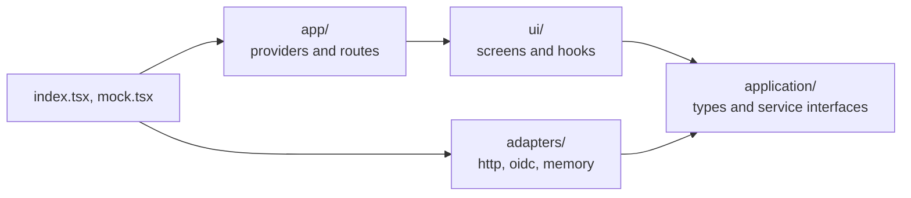

# Frontend development

How to run the Twake Space frontend and where new code goes.

## Run it on seed data

Mock mode needs Node 24 and nothing else: no backend, SSO or homeserver.

```bash
npm ci
npm run dev:mock -w @twake-space/frontend
```

Open http://localhost:3000. You're signed in as Alice Martin, an admin of the organization `acme.twake.local`, and three spaces cover each role and each resource state:

- Roadmap: admin, every app ready, with a feed of messages and cards
- Design Sprint: editor, Drive and Mail still being prepared, an empty feed
- Handover: viewer, chat and mail turned off

The organization has four people (alice, bob, carol, dave) and one group, Designers. Each space has direct members and the Designers group with their own roles. The seed lives in `apps/frontend/src/adapters/memory/seed.ts`, and uses the same organization, people and roles as the local SSO stack, so the screens look the same on the real backend.

Writes behave like the backend's: only a space admin can rename a space or change its members, and anyone else gets a 403 refusal.

What mock mode doesn't do:

- Changes vanish on reload.
- Nothing arrives live, and signing out only reloads the page.
- The Tasks tab says Tasks isn't set up unless `apps/frontend/public/.env.js` sets `TASKS_URL`, and the Mail tab likewise with `MAIL_URL`.
- Card links in the feed point nowhere.

## Run it against the backend

The main README covers the backend and `public/.env.js`. Signing in for real needs an SSO whose users belong to an organization, and an ldap-rest with spaces. That ldap-rest isn't released yet, so the full local stack can't be set up from this repo: ask Khaled Ferjani.

## How the code is laid out



- `application/` holds the types and the service interfaces (`SpacesService`, `FeedService`, and so on). It imports no framework.
- `adapters/` implements those interfaces: `http/` for the backend, `oidc/` for the SSO, `memory/` for mock mode.
- `ui/` renders screens and reaches services only through `useServices()`, never through an adapter.
- `index.tsx` wires the real adapters, and `mock.tsx` wires the memory ones. Rsbuild picks `mock.tsx` when `MOCK=1`, so production builds never include the seed.

ESLint enforces these boundaries, and a few more rules: named exports only, UI from `@linagora/twake-mui`, layout with twake-css classes instead of `sx` or inline styles.

## Services

`useServices()` gives the screens:

- `spaces`: list, read and create spaces. A space admin also renames or deletes a space, and adds, changes and removes its members and linked groups.
- `directory`: search the organization's people and groups, 20 per page, to pick new members from.
- `feed`: read a space's feed by filter and page, post, edit and delete your own posts, and react.
- `live`: the backend's live updates. `useLiveUpdates` refreshes the spaces queries when a space changes, and applies `feed` events to the feeds already loaded.
- `tasksUrl`: where the Tasks tab embeds Twake Tasks, or null.
- `mailUrl`: where the Mail tab embeds Twake Mail's team mailbox, or null.

A refused request rejects with a `Refusal`: the HTTP `status`, and the backend's reason as `code` (for example `not_space_admin`). Check it with `isRefusal` from `application/spaces.ts` to explain the refusal to the user. The [HTTP API](api.md) lists every route and its refusals.

## Add a feature

1. Add the types and the service interface in `application/`.
2. Implement it in `adapters/`, and add a memory version plus seed data so mock mode shows it.
3. Add a fake in `testing/` and pass it to `renderWithProviders`.
4. Build the screen in `ui/`.
5. Add every string to the seven files in `src/locales/`. A key missing from one fails the type check.

## Check before you push

```bash
npm run check -w @twake-space/frontend
```

It runs lint, formatting, the type check, the tests and the build, which is what CI runs. Tests sit next to the code as `*.spec.ts(x)` and use Testing Library with the fakes from `testing/`.
